# Introdução

Ao contrário do que ainda se confunde, aranhas não são insetos. Aranhas são aracnídeos e podem ser diferenciadas pelo corpo dividido em duas partes: Cefalotórax (ou Prosoma) e Abdômen (ou Metassoma), quatro pares de pernas articuladas e dois pares de apêndices bucais: Pedipalpos e Quelíceras. Todas as aranhas produzem seda, apesar de apenas cerca de metade das espécies usar essa seda para construir teias para capturar presas (PLATNICK, 2020)[^3].

Existem mais de 53 mil espécies de aranhas no mundo, divididas em aproximadamente 5 mil gêneros (WSC, 2026)[^1]. A grande maioria delas, peçonhentas e com quelíceras com as quais elas inoculam o veneno em suas presas (TRINDADE *et al.*, 2022)[^2]. Dentre elas, apenas 3 gêneros causam acidentes de interesse médico no Brasil.

<figure class="base">
    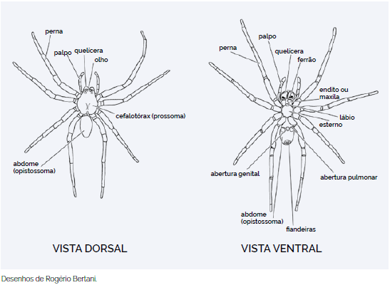
    <figcaption>
        
<b>Figura 1:</b> Morfologia externa das aranhas. <b>Fonte:</b> Brasil, 2024.

    </figcaption>
</figure>

# Aranhas de Importância Médica no Brasil
## Phoneutria

As aranhas do gênero *Phoneutria*, conhecidas como Aranhas-Armadeiras, são aranhas endêmicas da América do Sul (BUCARETCHI *et al.*, 2000)[^4]. Das 9 espécies descritas para esse gênero, 8 ocorrem no Brasil (BRASIL, 2024)[^5]. São aranhas relativamente grandes, podendo chegar a 15cm de envergadura, de hábito noturno, agressivas, inclusive contra humanos, o que é um comportamento muito incomum (PLATNICK, 2020). Caçam uma grande variedade de animais, incluindo muitas espécies de insetos, outras aranhas e até pequenos roedores (GOMEZ *et al.*, 2002)[^7]. Podem ser encontradas em quase todo o território nacional, com exceção de parte do Nordeste.

<figure class="base">
    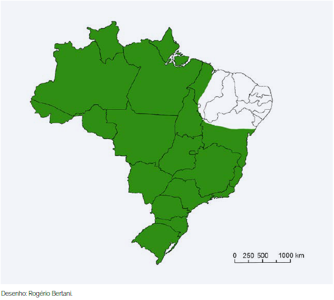Phoneutria</i> no Brasil">
    <figcaption>
        
<b>Figura 2:</b> Distribuição aproximada do gênero <i>Phoneutria</i> no Brasil. <b>Fonte:</b> Brasil, 2024.

    </figcaption>
</figure>

As armadeiras são assim chamadas pelo comportamento que apresentam ao sentirem-se ameaçadas, apoiando-se nas pernas traseiras e esticando as dianteiras.

<figure class="base">
    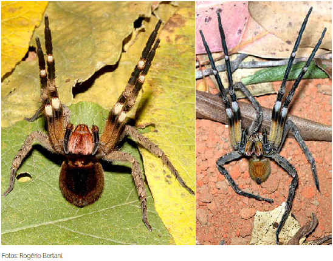
    <figcaption>
        
<b>Figura 3:</b> Aranhas-armadeiras em posição defensiva. <b>Fonte:</b> Brasil, 2024.

    </figcaption>
</figure>

Não constroem teias e, durante o dia, escondem-se debaixo de troncos, madeira empilhada, pedras, tijolos, telhas ou na vegetação (BRASIL, 2024).

<figure class="base">
    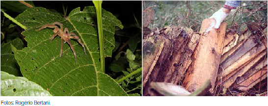
    <figcaption>
        
<b>Figura 4:</b> Aranhas-armadeiras em ambiente natural e antropizado. <b>Fonte:</b> Brasil, 2024.

    </figcaption>
</figure>

<figure class="base">
    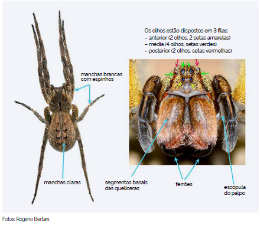
    <figcaption>
        
<b>Figura 5:</b> Características principais das aranhas-armadeiras. <b>Fonte:</b> Brasil, 2024.

    </figcaption>
</figure>

Aranhas-armadeiras são a segunda maior causa de acidentes aracnídicos no Brasil, com a maioria dos casos ocorrendo nas regiões sudeste e sul do Brasil (BUCARETCHI *et al.*, 2000).

<figure class="base">
    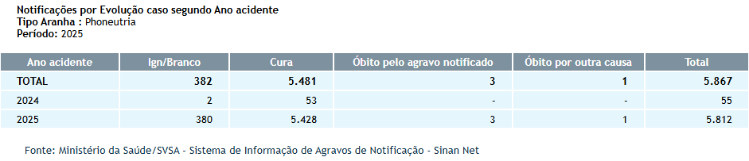Phoneutria</i>">
    <figcaption>
        
<b>Figura 6:</b> Notificações de acidentes causados por <i>Phoneutria</i>. <b>Fonte:</b> SINAN, 2019.<a href="#fn:6">6</a>

    </figcaption>
</figure>

O veneno da *Phoneutria* é neurotóxico e pode causar dor intensa e irradiante, câimbras, tremores, convulsões tônicas, paralisia espástica (enrijecimento muscular e espasmos), priapismo, salivação, arritmias, distúrbio visual, vômitos e sudorese local (BUCHARETCHI *et al.*, 2000[^4]; 2023[^8]; GOMEZ *et al.*, 2002[^7]; FERNANDES *et al.*, 2022[^9]).

<figure class="base">
    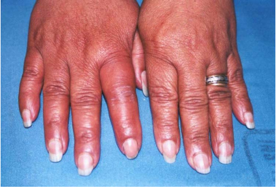">
    <figcaption>
        
<b>Figura 7:</b> Acidente causado por <i>Phoneutria</i>. <b>Fonte:</b> São Paulo, 2013.<a href="#fn:10">10</a>

    </figcaption>
</figure>

## Loxosceles

Aranhas do gênero *Loxosceles* são popularmente conhecidas como Aranhas-marrons. Possuem 148 espécies (WSC, 2026) no mundo e 19 delas, amplamente distribuídas no território nacional (BRASIL, 2024). São aranhas pequenas, chegando a 4cm de envergadura, de comportamento não agressivo, preferindo se manter imóveis e fingindo-se de mortas (PLATNICK, 2020).

<figure class="base">
    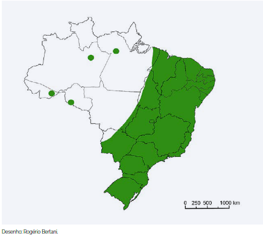Loxosceles</i>">
    <figcaption>
        
<b>Figura 8:</b> Distribuição aproximada do gênero <i>Loxosceles</i> no Brasil. <b>Fonte:</b> Brasil, 2024.

    </figcaption>
</figure>

Constroem teias irregulares, geralmente em espaços protegidos, como fendas entre raízes, entre folhas de palmeiras, debaixo de pedras e galhos, debaixo de tijolos, telhas, madeira empilhada, atrás de quadros, dentro de forros, dentro ou atrás de móveis etc (BRASIL, 2024). 

<figure class="base">
    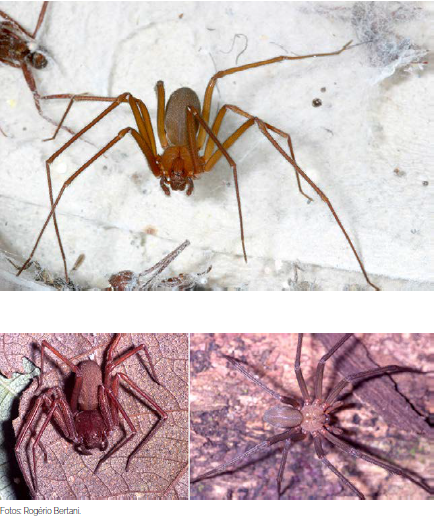
    <figcaption>
        
<b>Figura 9:</b> Exemplos de espécies de aranhas-marrons. <b>Fonte:</b> Brasil, 2024.

    </figcaption>
</figure>

<figure class="base">
    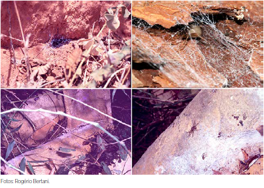
    <figcaption>
        
<b>Figura 10:</b> Aranhas-marrons em ambientes naturais e antropizados. <b>Fonte:</b> Brasil, 2024.

    </figcaption>
</figure>

Aranhas-marrons são a principal causa de acidentes aracnídicos no Brasil (BRASIL, 2024). Devido aos seus hábitos, comportamentos e tamanho, a principal causa de acidentes com aranhas-marrons se dá ao comprimi-las contra o corpo, principalmente ao calçar calçados, vestir roupas ou rolar na cama.

<figure class="base">
    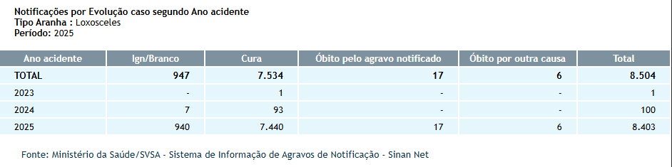Loxosceles</i>">
    <figcaption>
        
<b>Figura 11:</b> Notificações de acidentes causados por <i>Loxosceles</i>. <b>Fonte:</b> SINAN, 2019.

    </figcaption>
</figure>

O veneno da *Loxosceles* é rico em proteases, fosfatases alcalinas, hialuronidases, fosfolipases, entre outros componentes. O principal sintoma do loxoscelismo é a ocorrência de dermonecrose no local da picada (RIBEIRO *et al.*, 2015)[^11], podendo ocorrer febre, mal-estar, anemia hemolítica, trombocitopenia (diminuição no número de plaquetas) e coagulação intravascular disseminada, sendo a lesão renal aguda a principal causa de morte (SILVA-MAGALHÃES *et al.*, 2024)[^12]

<figure class="base">
    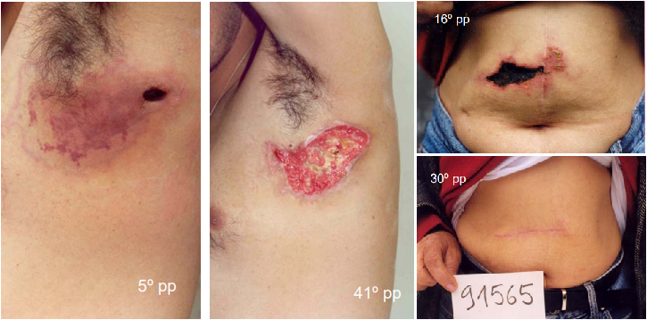Loxosceles</i>">
    <figcaption>
        
<b>Figura 12:</b> Acidentes causados por <i>Loxosceles</i>. <b>Fonte:</b> São Paulo, 2013<a href="#fn:10">10</a>.

    </figcaption>
</figure>

## Latrodectus

As aranhas do gênero *Latrodectus*, popularmente chamadas de Viúvas-negras, são facilmente reconhecidas pelo abdômen globoso, pernas longas e finas, marcas dorsais vermelhas ou laranjas que servem como sinalização aposemática (ZEMBRUSKI *et al.*, 2025)[^13] e em alguns casos, um padrão em forma de ampulheta na região ventral (PLATNICK, 2020). Estão presentes em boa parte do Brasil, mas são mais comuns em áreas próximas ao litoral (BRASIL, 2024). São aranhas pequenas, chegando a 3cm de envergadura, de comportamento não agressivo.

<figure class="base">
    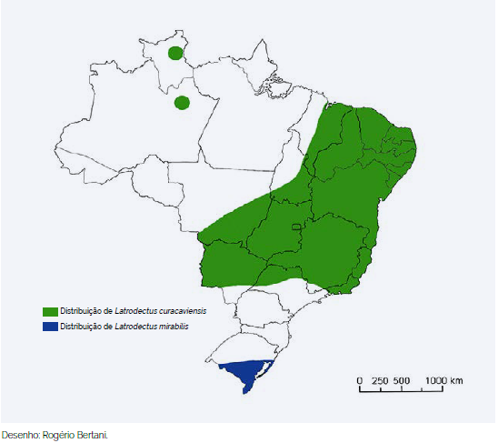Latrodectus</i> no Brasil">
    <figcaption>
        
<b>Figura 13:</b> Distribuição aproximada do gênero <i>Latrodectus</i> no Brasil. <b>Fonte:</b> Brasil, 2024.

    </figcaption>
</figure>

Assim como as *Loxosceles*, constroem teias irregulares, geralmente próximas ao solo, em vegetação baixa, debaixo de pedras, cascas de coco, pneus velhos, pilhas de telhas, paredes de casas (BRASIL, 2024).

<figure class="base">
    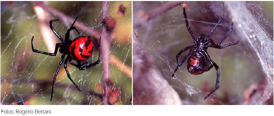Latrodectus curacaviensis</i> fêmea. Vista dorsal e ventral.">
    <figcaption>
        
<b>Figura 14:</b> <i>Latrodectus curacaviensis</i> fêmea. Vista dorsal e ventral. <b>Fonte:</b> Brasil, 2024.

    </figcaption>
</figure>

Apesar de toda a mística e senso comum em torno de si, acidentes causados por Latrodectus não são comuns, principalmente levando-se em conta seu tamanho e hábitos (BRASIL, 2024).

<figure class="base">
    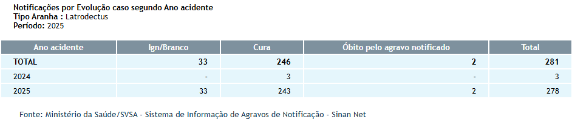Latrodectus</i>">
    <figcaption>
        
<b>Figura 15:</b> Notificações de acidentes causados por <i>Latrodectus</i>. <b>Fonte:</b> SINAN, 2019.

    </figcaption>
</figure>

O veneno da *Latrodectus* é neurotóxico, constituído de uma mistura complexa de proteínas e peptídeos. Os sintomas mais frequentes são forte dor ardente irradiando do local da picada e dor muscular generalizada. Podem ocorrer câimbras, contrações involuntárias, hipertonia (rigidez muscular), salivação, sudorese, aumento na pressão sanguínea e alteração renal. Óbito não é comum, mesmo sem o uso de soro, mas pode ocorrer, geralmente por edema pulmonar a falência cardíaca (CARUSO, 2021)[^14]

# Menções honrosas

No Brasil, temos outras aranhas que também causam acidentes, mas que não tem veneno ativo em seres-humanos, como as *Lycosas* e as Caranguejeiras.

## Lycosa

Aranhas do gênero *Lycosa* (e outros gêneros da família *Lycosidae*) são popularmente conhecidas como Aranhas-lobo, Tarântulas-de-grama ou Tarântulas-de-jardim. São aranhas errantes, que caçam ativamente suas presas, não constroem teias e são facilmente encontradas em jardins, gramados e até mesmo dentro das casas. São aranhas de porte médio, podendo chegar a 7cm de envergadura e é uma das aranhas mais abundantes na nossa região (BRASIL, 2001 [^15]; MARTINS, 2025[^16]).

<figure class="base">
    Lycosa</i>">
    <figcaption>
        
<b>Figura 16:</b> Exemplos de <i>Lycosa</i>. <b>Fonte:</b> Imagem autoral.

    </figcaption>
</figure>

Apesar de comuns, os acidentes com *Lycosa* não são considerados de importância médica e, em geral, são reportados sintomas como dor, sudeorese, eritema (vermelhidão) e prurido (coceira) (LIVSHITS, 2012[^17]) 

## Caranguejeiras

As caranguejeiras não são uma espécie única, mas um complexo rico com mais de 1000 espécies que formam a família Theraphosidae (FILHO *et al.*, 2021[^18]). Existem cerca de 400 espécies de caranguejeiras no Brasil. São aranhas de médio a grande porte, com algumas chegando a quase 30cm de envergadura. Têm o corpo geralmente coberto de pelos (BRASIL, 2024). Fora do Brasil são muito utilizadas como pets (FUCHS *el al*, 2014[^19]; KONG & HART, 2023[^22]).

<figure class="base">
    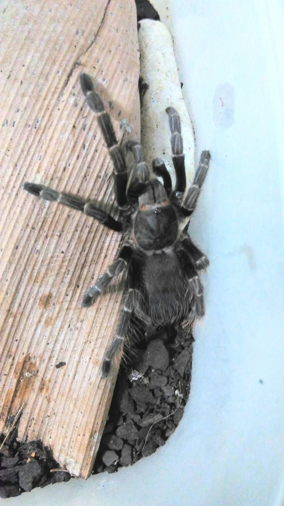
    <figcaption>
        
<b>Figura 17:</b> Exemplo de Caranguejeira. <b>Fonte:</b> Imagem autoral.

    </figcaption>
</figure>

<figure class="base">
    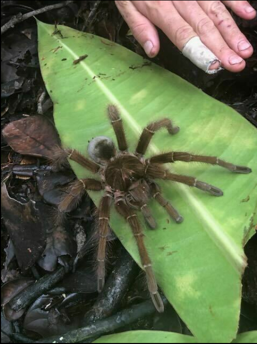Theraphosa blondi</i>">
    <figcaption>
        
<b>Figura 18:</b> <i>Theraphosa blondi</i>. <b>Fonte:</b> iNaturalist.<a href="#fn:24">24</a> <b>Autor da imagem:</b> Martin Ingemansson.

    </figcaption>
</figure>

<figure class="base">
    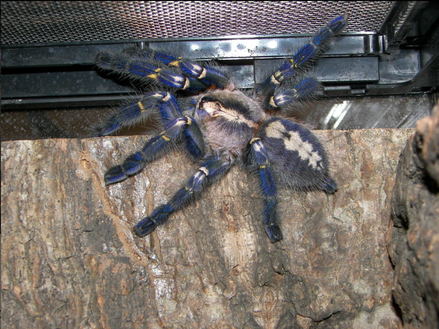Poecilotheria metallica</i>">
    <figcaption>
        
<b>Figura 19:</b> <i>Poecilotheria metallica</i>. <b>Fonte:</b> iNaturalist.<a href="#fn:24">24</a> <b>Autor da imagem:</b> John (snakecollector).

    </figcaption>
</figure>

Apesar do seu tamanho e aparência, acidentes com caranguejeiras são raros (LUCAS *et al.*, 1994; ISBISTER *et al.*, 2003[^21]). Em geral, o veneno das caranguejeiras tem ação neurotóxico, causando paralisia em suas presas (KONG & HART, 2023). Embora existam algumas caranguejeiras capazes de provocar envenenamentos sérios em humanos (LUCAS *et al.*, 1994[^20]; FUCHS *et al.*, 2014), nenhuma delas é natural do Brasil. Caranguejeiras brasileiras provocam apenas efeitos mínimos (ISBISTER *et al.*, 2003), como dor local, edema e eritema (LUCAS *et al.*, 1994). Porém, algumas caranguejeiras possuem outro mecanismo de defesa, pelos ou cerdas urticantes que elas ejetam do corpo usando as pernas (BERTANI & GUADANUCCI, 2013[^23]). Essas cerdas, em contato com a pele e mucosas, pode gerar reações inflamatórias, sendo considerados alérgenos de certa gravidade, além de lesões oculares, se em contato com os olhos (FILHO *et al.*, 2021).

<figure class="base">
    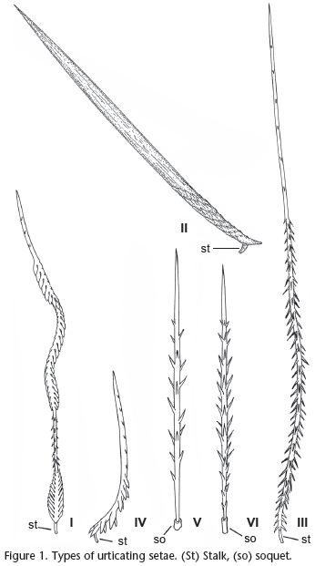
    <figcaption>
        
<b>Figura 20:</b> Desenho de cerdas urticantes. <b>Fonte:</b> Bertani & Guadanucci, 2013.

    </figcaption>
</figure>

# Prevenção e Primeiros-Socorros em caso de acidente

## Introdução

Conhecer o agente, a causa e as circunstâncias de acidentes que já aconteceram é imprescindível para que saibamos as melhores formas de prevenir que ocorram novamente. Tratando-se de acidentes com aranhas, a maioria ocorre nos meses mais quentes e chuvosos (outubro a abril), principalmente na região sul do país (BUCARETCHI *et al.*, 2000; ZEMBRUSKI *et al.*, 2025), mas devido às aranhas terem se adaptado à regiões antropizadas, a incidência de acidentes permanece estável durante o ano todo (CHIPPAUX, 2015)[^25]. As regiões mais atingidas foram as mãos, pés e dedos (ZEMBRUSKI *et al.*, 2025).

## Prevenção de acidentes

Com base nessas informações, as principais ações para prevenir acidentes são:
- **Atenção:** Olhar com atenção onde pisa e/ou coloca a mão, principalmente em locais quentes, escuros e úmidos e com acúmulo de entulho/restos de construção. Sacudir roupas e sapatos antes de usá-los;
- **Uso de EPI:** Usar sapatos fechados e luvas de aparas de couro;
- **Controle de pragas:** Controlar a proliferação de insetos que podem servir de alimento para as aranhas, tais como baratas;
- **Manutenção:** Vedar frestas e buracos em paredes, assoalhos e vãos entre forros e paredes, telar janelas;
- **Limpeza:** Manter jardins e quintais limpos, evitar acúmulo de lixo ou entulho, aparar a grama, limpar terrenos baldios.

## Primeiros-socorros

Em casos de acidentes, o que se **DEVE** fazer:

- Se possível, lavar o local da picada com água e sabão;
- Usar compressas mornas ajudam no alívio da dor;
- Procurar atendimento médico mais próximo;
- Se possível, levar o animal para identificação;

O que **NÃO** fazer:

- Não aplicar torniquete ou garrote no membro acometido;
- Não cortar, queimar, espremer ou aplicar qualquer tipo de substância, tais como borra de café, álcool, terra, folhas, fezes, urina, entre outros no local da picada;
- Não fazer curativo no local da picada, pois pode favorecer a ocorrência de infecção;
- Não dar bebidas alcoólicas ou outros líquidos como gasolina ou querosene à vitima, pois podem causar problemas gastrointestinais, além de não terem efeito contra a peçonha;
- Não tentar chupar o veneno, pois pode favorecer a ocorrência de infecção.

# Conclusão

Apesar de a maioria dos acidentes com aranhas serem classificados como leves e evoluírem para a cura apenas com tratamentos sintomáticos (ZEMBRUSKI *et al.*, 2025), há tratamentos por soro anti-aracnídico para casos mais severos. Por isso é muito importante que, em caso de acidente, se possível, apresentar o animal que o causou, seja por fotografia ou o próprio animal. Neste caso, a conservação do animal pode ser feita pela imersão em álcool comum, em recipiente apropriado, com dados do local do acidente para ser encaminhado para identificação correta (BRASIL, 2024).

---

[^1]: World Spider Catalog 2026. **World Spider Catalog**. Version 26. Natural History Museum Bern. DOI: 10.24436/2. Disponível em: http://wsc.nmbe.ch. Acesso em: 05 jan. 2026.

[^2]: TRINDADE, J.V.F.; FERRAREIS, L.A.; ANDRADE, A.K.C.A.; BORGES, J.M.S.; MONTENEGRO, S.S.P.; RODRIGUES, B.S.S.L.; MIGUEL, P.S.B.; SIQUEIRA-BATISTA, R. Spiders in Brazil: from arachnidism to potential therapeutic use of their venom part 1 of 2. **Revista de Patologia Tropical / Journal of Tropical Pathology**, Goiânia, v. 51, n. 1, p. 1–16, 2022. DOI: 10.5216/rpt.v51i1.67446. Disponível em: https://revistas.ufg.br/iptsp/article/view/67446. Acesso em: 5 jan. 2026.

[^3]: PLATNICK, N.I. (ed.). **Spiders of the world: a natural history**. Princeton; Oxford: Princeton University Press, 2020. ISBN 978-0-691-18885-0.

[^4]: BUCARETCHI, F.; DEUS REINALDO, C.R.; HYSLOP, S.; MADUREIRA, P.R.; DE CAPITANI, E.M.; VIEIRA, R.J. A Clinico-epdemiological Study of Bites by Spiders of the Genus *Phoneutria*. **Revista do Instituto de Medicina Tropical de São Paulo**, v. 42, 2000. DOI: https://doi.org/10.1590/S0036-46652000000100003. Disponível em: https://www.scielo.br/j/rimtsp/a/YjV9rzJH4jPBGt8ZhghtNGg. Acesso em: 05 jan. 2026.

[^5]: BRASIL. Ministério da Saúde. Secretaria de Vigilância em Saúde e Ambiente. Departamento de Doenças Transmissíveis. **Guia de Animais Peçonhentos do Brasil**. Brasília, 2024. 164 p.

[^6]: BRASIL. Ministério da Saúde. Sistema de Informação de Agravos de Notificação - Sinan Net. Brasília: Ministério da Saúde, 16 abr. 2019. Disponível em: http://tabnet.datasus.gov.br/cgi/deftohtm.exe?sinannet/cnv/animaisbr.def. Acesso em: 05 jan. 2026.

[^7]: GOMEZ, M.V.;KALAPOTHAKIS, E.; GUATIMOSIN, C.; PRADO, M.A.M. *Phoneutria nigriventer* Venom: A Cocktail of Toxins That Affect Ion Channels. **Cellular and Molecular Neurobiology**, Vol. 22, Nº 5/6, 2002. DOI: https://doi.org/10.1023/A:1021836403433. Disponível em: https://pmc.ncbi.nlm.nih.gov/articles/PMC11533758/. Acesso em: 05 jan. 2026.

[^8]: BUCARETCHI, F.; MILETI L.N.CR.; RICARDI A.S.T; BORRASCA-FERNANDES, C.F.; PRADO, C.C.; DE CAPITANI, E.M.; HYSLOP, S. Assessment of local pain and analgesia in envenoming by wandering spiders (_Phoneutria_ spp.). **Toxicon**. Volume 226, 2023. DOI: https://doi.org/10.1016/j.toxicon.2023.107083. Disponível em: https://www.sciencedirect.com/science/article/abs/pii/S0041010123000697. Acesso em: 05 jan. 2026.

[^9]: FERNANDES, F.F.; MORAES, J.R.; SANTOS, J.L.; SOARES, T.G.; GOUVEIA, V.J.P.; MATAVEL, A.C.S.; BORGERS, W.C.; CORDEIRO, M.N.; FIGUEIREDO, S.G.; BORGES, M.H. Comparative venomic profiles of three spiders of the genus *Phoneutria*. **Journal of Venomous Animals and Toxins including Tropical Diseases**, Volume 28, 2022. DOI: https://doi.org/10.1590/1678-9199-JVATITD-2021-0042. Disponível em: https://www.scielo.br/j/jvatitd/a/rtKchPb89ncNC6Hk6P47QVt. Acesso em: 05 jan. 2025.

[^10]: SÃO PAULO. Centro de Vigilância Epidemiológica. Acidentes por animais peçonhentos. Instituto Butantan, 2013. Disponível em: http://www.saude.sp.gov.br/resources/cve-centro-de-vigilancia-epidemiologica/areas-de-vigilancia/doencas-de-transmissao-por-vetores-e-zoonoses/aula03_peconhentos.pdf. Acesso em: 30 dez. 2025.

[^11]: RIBEIRO, M.F.; OLIVEIRA, F.L.; MONTEIRO-MACHADO, M.; CARDOSO, P.F.; GUILARDUCCI-FERRAZ, V.V.C.; MELO, P.A.; SOUZA, C.M.V.; CALIL-ELIAS, S. Pattern of inflammatory response to *Loxosceles intermedia* venon in distinct mouse strains: A key element to understand skin lesions and dermonecrosis by poisoning. **Toxicon**, Volume 96, p. 10-23, 2015. DOI: https://doi.org/10.1016/j.toxicon.2015.01.008. Disponível em: https://www.sciencedirect.com/science/article/abs/pii/S0041010115000112. Acesso em: 05 jan. 2026.

[^12]: SILVA-MAGALHÃES, R.; SANTOS, A.M.G.; SILVA-ARAÚJO, A.L.; PERES-DAMÁSIO, P.L.; ALVARENGA, V.G.; OLIVEIRA, L.S.; SANCHEZ, E.F.; CHÁVEZ-OLÓRTEGUI, C.; VARELA, L.S.R.N.; PAIVA, A.L.B.; GUERRA-DUARTE, C. Venom from *Loxosceles* Spiders Collected in Southeastern and Northeastern Brazilian Regions Cause Hemotoxic Effects on Human Blood Components. **Toxins**, V. 16, n. 532, 2024. DOI: https://doi.org/10.3390/toxins16120532. Disponível em: https://www.mdpi.com/2072-6651/16/12/532. Acesso em: 05 jan. 2026.

[^13]: ZEMBRUSKI, F.S.; CARNIEL, T.A.; BUSATO, M.A.; LUTINSKI, J.A. An Epidemiological Overview of Envenomation Involving *Latrodectus sp.* and Unidenfied Spider Species in Southern Brasil. **Journal of Advances in Medicine and Medical Research**, v. 37, Issue 9, p. 1-16, 2025. ISSN: 2456-8899. DOI: https://doi.org/10.9734/jammr/2025/v37i95921. Disponível em: https://journaljammr.com/index.php/JAMMR/article/view/5921. Acesso em: 06 jan. 2026.

[^14]: CARUSO, M.B.; LAURIA, P.S.S.; SOUZA, C.M.V.; CASAIS-E-SILVA, L.L.; ZINGALI, R.B. Widow spiders in the New World: a review on *Latrodectus* Walckenaer, 1805 (Theridiidae) and latrodectism in the Americas. **Journal of Venomous Animals and Toxins includind Tropical Diseases**, V. 27, 2021. DOI: https://doi.org/10.1590/1678-9199-JVATITD-2021-0011. Disponível em: https://www.scielo.br/j/jvatitd/a/QBWggNQ7rWSG5XVx3BgvY9g. Acesso em: 06 jan. 2026.

[^15]: BRASIL. Ministério da Saúde. Fundação Nacional de Saúde (FUNASA). Manual de Diagnóstico e Tratamento de Acidentes por Animais Peçonhentos. Brasília: Fundação Nacional de Saúde, 2001. Disponível em: https://www.gov.br/saude/pt-br/centrais-de-conteudo/publicacoes/guias-e-manuais/2024/manual-de-diagnostico-e-tratamento-de-acidentes-por-animais-peconhentos.pdf. Acesso em: 29 dez. 2025.

[^16]: MARTINS, N.S. Lycosidae sp. (Araneae: Lycosidae): Comportamento Maternal e Preferências Ecológicas de uma Nova Espécie do Cerrado. **Trabalho de Conclusão de Curso (Graduação em Ciências Biológicas)**, 26 f, 2025. Universidade Federal de Uberlândia, Uberlândia, 2025.

[^17]: LIVSHITS, Z.; BERNSTEIN, B.; SORKIN, L.N.; SMITH, S.W.; HOFFMAN, R.S. Wolf Spider Envenomation. _Wilderness & Environmental Medicine_, v. 23, Issue 1, p. 49-50, 2012. DOI: https://doi.org/10.1016/j.wem.2011.11.010. Disponível em: https://journals.sagepub.com/doi/10.1016/j.wem.2011.11.010. Acesso em: 06 jan. 2006.

[^18]: FILHO, E.P. de M.; FILHO, A.L.P.L. de O.; PACÍFICO, D.S. dos S.; JÚNIOR, H.M.L.; CARVALHO, M.N.; ANDRADE, E.S.; NUNES, R.M.O.; DUARTE, J.P.F.; VILAR, D.A.R.; BELTRÃO, R.P.L. Urticárias e manifestações clínicas provocadas pelo contato com aranhas caranguejeiras: uma revisão de literatura. **Brazilian journal of Development**, v. 7, n. 3, p. 22287-22297, 2021. ISSN: 2525-8761. DOI: https://doi.org/10.34117/bjdv7n3-102. Disponível em: https://ojs.brazilianjournals.com.br/ojs/index.php/BRJD/article/view/25783. Acesso em: 6 jan. 2026.

[^19]: FUCHS, J.; von DECHEND, M.; MORDASINI, R.; CESCHI, A.; NENTWIG, W. A verified spider bite and a review of the literature confirm Indian ornamental tree spiders (*Poecilotheria* species) as underestimated theraphosids of medical inportance. **Toxicon**, v. 77, p. 73-77, 2014. DOI: https://doi.org/10.1016/j.toxicon.2013.10.032. Disponível em: https://www.sciencedirect.com/science/article/abs/pii/S0041010113004182. Acesso em: 06 jan. 2026.

[^20]: LUCAS, S.M.; da SILVA, P.I.; BERTANI, R.; CARDOSO, J.L.C. Mygalomorph spider bites: a report on 91 cases in the State of São Paulo, Brazil. **Toxicon**, v. 32, p. 1211-1215, 1994. Disponível em: https://ecoevo.com.br/publicacoes/pesquisadores/rogerio_bertani/1012%20Toxicon.pdf. Acesso em: 06 jan. 2026.

[^21]: ISBISTER, G.K.; SEYMOUR, J.E.; GRAY, M.R.; RAVEN, R.J. Bites by spiders of the family Theraphosidae in humans and canines. **Toxicon**, v. 41, Issue 4, p. 519-524, 2003. DOI: https://doi.org/10.1016/S0041-0101(02)00395-1. Disponível em: https://www.sciencedirect.com/science/article/abs/pii/S0041010102003951. Acesso em: 06 jan. 2026.

[^22]: KONG, E.L.; HART, K.K. _Tarantula spider toxicity_. StatPearls [Internet]. Treasure Island (FL): StatPearls Publishing, 2023. Disponível em: https://www.ncbi.nlm.nih.gov/books/NBK557667/?utm_source=chatgpt.com. Acesso em: 06 jan. 2026.

[^23]: BERTANI, R.; GUADANUCCI, J.P.L. Morphology, evolution and usage of uticating setae by tarantulas (Araneae: Theraphosidae). **Zoologia (Curitiba)**, v. 30, 2013. DOI: https://doi.org/10.1590/S1984-46702013000400006. Disponível em: https://www.scielo.br/j/zool/a/RvWPmmMFfcT6dBPGWCgzPym. Acesso em: 06 jan. 2026.

[^24]: INATURALIST. iNaturalist: plataforma de ciência cidadã para registro de biodiversidade. [S.l.]: iNaturalist, s.d. Disponível em: https://www.inaturalist.org/. Acesso em: 06 jan. 2026.

[^25]: CHIPPAUX, J.P. Epidemiology of envenomations by terrestrial venomous animal in Brasil based on case reporting: from obvious facts to contingencies. **Journal of Venomous Animals and Toxins including Tropical Diseases**, v. 21, 2015. DOI: https://doi.org/10.1186/s40409-015-0011-1. Disponível em: https://www.scielo.br/j/jvatitd/a/r9ZgKxxmd5xvjqd4WD8g3Kv. Acesso em: 06 jan. 2026.
