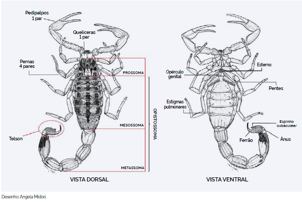
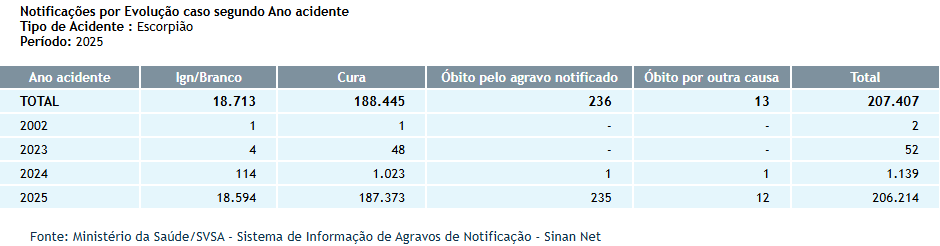
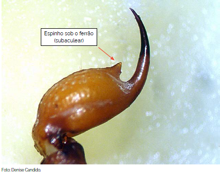
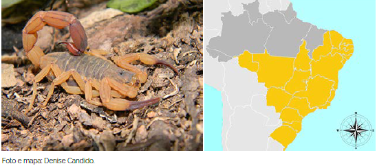
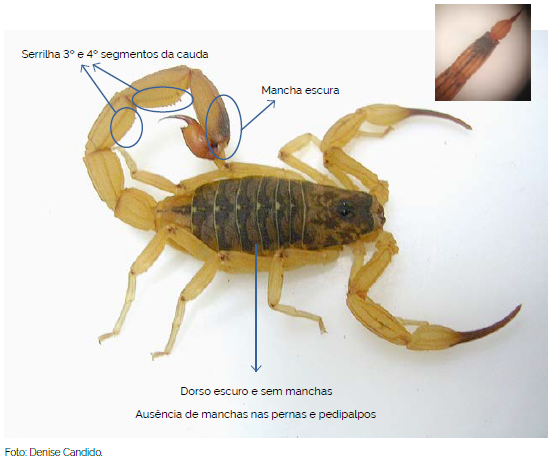
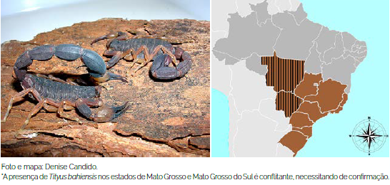
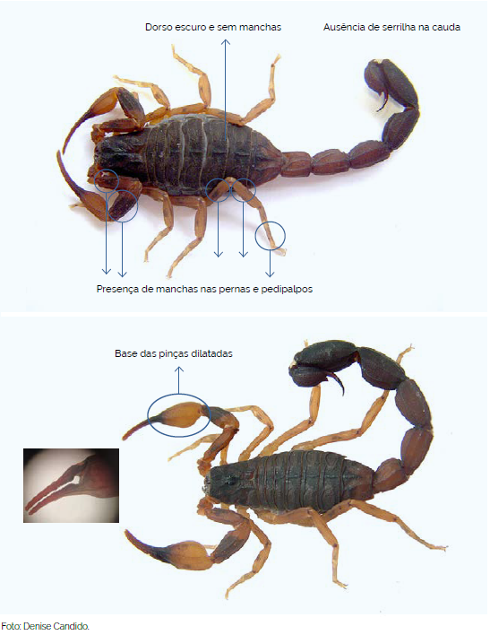
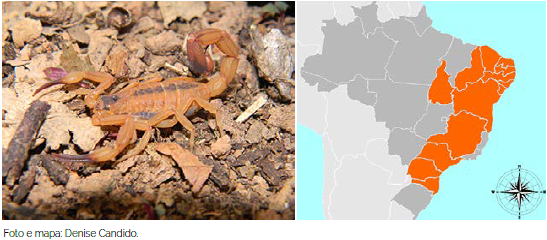
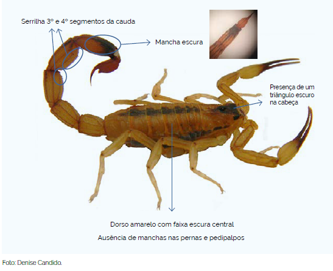

# Introdução

Existem cerca de 2910 espécies de escorpiões no mundo, classificados em 24 famílias (REIN, 2017)[^1]. Apenas 4 dessas famílias ocorrem no Brasil e, dessas 4, apenas uma é de importância médica (BRASIL, 2024)[^2]. Assim como as aranhas, os escorpiões são aracnídeos e, como elas, tem o corpo segmentado em 2: Cefalotórax (Prossoma) e Abdômen (Opistossoma); possuem 4 pares de pernas articuladas e 2 pares de peças bucais: Pedipalpos (pinças ou garras) e Quelíceras. O abdômen é divido em Tronco (Mesossoma) e Cauda (Metassoma). No final da cauda, encontra-se o Télson, que contêm as glândulas de veneno e o ferrão (BRASIL, 2024).

<figure class="base">
    
    <figcaption>
        
<b>Figura 1:</b> Morfologia externa. Vistas dorsal e ventral. <b>Fonte:</b> Brasil, 2024.

    </figcaption>
</figure>

São animais sinantrópicos, cosmopolitas, carnívoros, de hábito noturno e se alimentam, principalmente de outros artrópodes, como outros escorpiões e insetos, como grilos, gafanhotos e baratas (ALMEIDA, 2021[^6]).Algumas espécies de escorpiões são consideradas partenogênicas, ou seja, conseguem se reproduzir sem que haja fertilização dos ovos pelo gameta feminino (BRASIL, 2024). Escorpiões têm a menor taxa metabólica no reino animal, contribuindo para sua sobrevivência durante longos períodos sem água e/ou alimento (cerca de 1 ano sem água e alimento e até 3 anos com água, mas sem alimento)(GUERRA *et al.*, 2022). 

A maioria dos acidentes é classificado como leve (COSTA *et al.*, 2016[^7]), apresentando dor local, com ou sem parestesia (dormência, formigamento). Casos moderados e graves podem apresentar sudorese, náuseas, vômitos, taquicardia (aceleração do batimento cardíaco), taquipneia (respisração rápida e superficial), hipertensão, salivação, prostração, convulsão, coma, edema pulmonar, insuficiência cardíaca e choque (MENDES *et al.*, 2023; TAKEHARA *et al.*, 2023). O tratamento com soro antiescorpiônico é indicado em casos moderados e graves, pricipalmente em acidentes com crianças com idade abaixo de 10 anos (OLIVEIRA *et al.*, 2022[^8]; TAKEHARA *et al.*, 2023)

<figure class="base">
    
    <figcaption>
        
<b>Figura 2:</b> Notificações de acidentes causados por escorpiões. <b>Fonte:</b> SINAN, 2019<a href="#fn:9">9</a>.

    </figcaption>
</figure>

# Escorpiões de Importância Médica no Brasil
## Tityus

Dentro da família Buthidae, os escorpiões do gênero *Tityus* são os mais perigosos e são a principal causa de acidente por animais peçonhentos no país (GUERRA *et al.*, 2022)[^3]. Uma das características do gênero *Tityus* é a presença de um espinho sob o ferrão (BRASIL, 2024).

<figure class="base">
    Tityus</i>">
    <figcaption>
        
<b>Figura 3:</b> Espinho subaculear característico do gênero <i>Tityus</i>. <b>Fonte:</b> Brasil, 2024.

    </figcaption>
</figure>

### *Tityus serrulatus* (escorpião amarelo)

É considerado o escorpião mais perigoso do país, devido à sua ampla distribuição, tanto no campo quanto nos centros urbanos, grande proliferação partenogênica e o potencial de seu veneno (GUERRA *et al.*, 2022; TAKEHARA *et al.*, 2023[^4]). Têm de 5 a 7 cm de comprimento e, como o nome sugere, tem coloração amarelada, com o tronco escuro, pernas e palpos sem manchas e apresentam um serrilha (por isso o epíteto específico *serrulatus*) no terceiro e quarto segmentos da cauda (BRASIL, 2024).

<figure class="base">
    Tityus serrulatus</i> e mapa de distribuição">
    <figcaption>
        
<b>Figura 4:</b> <i>Tityus serrulatus</i> e mapa de distribuição. <b>Fonte:</b> Brasil, 2024.

    </figcaption>
</figure>

<figure class="base">
    Tityus serrulatus</i>">
    <figcaption>
        
<b>Figura 5:</b> Principais características de <i>Tityus serrulatus</i>. <b>Fonte:</b> Brasil, 2024.

    </figcaption>
</figure>

A picada do escorpião amarelo é responsável pela maioria dos casos com evolução grave e fatal (TAKEHARA, 2023). Seu veneno é neurotóxico composto por muco, lipídios, aminas, sais inorgânicos, peptídeos, proteínas, aminoácidos e enzimas (MENDES *et al.*, 2023[^5]).

### *Tityus bahiensis* (escorpião marrom)

Têm de 5 a 7 cm de comprimento, coloração marrom-avermelhado, com tronco escuro e sem manchas, pernas e palpos com manchas escuras e ausência de serrilha na cauda (BRASIL, 2024).

<figure class="base">
    Tityus bahiensis</i> e mapa de distribuição">
    <figcaption>
        
<b>Figura 6:</b> <i>Tityus bahiensis</i> e mapa de distribuição. <b>Fonte:</b> Brasil, 2024.

    </figcaption>
</figure>

<figure class="base">
    Tityus bahiensis</i>">
    <figcaption>
        
<b>Figura 7:</b> Principais características de <i>Tityus bahiensis</i>. <b>Fonte:</b> Brasil, 2024.

    </figcaption>
</figure>

### *Tityus stigmurus* (escorpião amarelo do Nordeste)

Têm de 5 a 7 cm de comprimento, de coloração amarelada, presença de um triângulo escuro na face dorsal do cefalotórax, uma faixa escura central bem definida e duas laterais discretasna face dorsal do tronco, pernas e palpos sem manchas e discreta serrilha no terceiro e quarto segmentos da cauda.

<figure class="base">
    Tityus stigmurus</i> e mapa de distribuição">
    <figcaption>
        
<b>Figura 8:</b> <i>Tityus stigmurus</i> e mapa de distribuição. <b>Fonte:</b> Brasil, 2024.

    </figcaption>
</figure>

<figure class="base">
    Tityus stigmurus</i>">
    <figcaption>
        
<b>Figura 9:</b> Principais características de <i>Tityus stigmurus</i>. <b>Fonte:</b> Brasil, 2024.

    </figcaption>
</figure>

# Prevenção e Primeiros-Socorros em caso de acidente

## Introdução

Conhecer o agente, a causa e as circunstâncias de acidentes que já aconteceram é imprescindível para que saibamos as melhores formas de prevenir que ocorram novamente. Tratando-se de acidentes com escorpiões, a maioria ocorre nos meses mais quentes e chuvosos (outubro a dezembro), principalmente nas regiões nordeste e sudeste do país (COSTA *et al.*, 2016; GUERRA *et al.*, 2022), mas devido ao escorpiões terem se adaptado à regiões antropizadas, a incidência de acidentes permanece estável durante o ano todo (OLIVEIRA *et al.*, 2022)[^25], atingindo principalmente pessoas do sexo feminino (ALMEIDA *et al.*, 2021; OLIVEIRA *et al.*, 2022). A maioria dos casos graves e fatais evolui de acidentes em crianças menores de 15 anos e idosos e/ou portadores de comorbidades (OLIVEIRA *et al.*, 2022; TAKEHARA *et al.*, 2023).

## Prevenção de acidentes

Com base nessas informações, as principais ações para prevenir acidentes são:
- **Atenção:** Olhar com atenção onde pisa e/ou coloca a mão, principalmente em locais quentes, escuros e úmidos e com acúmulo de entulho/restos de construção. Sacudir roupas e sapatos antes de usá-los;
- **Uso de EPI:** Usar sapatos fechados e luvas de aparas de couro;
- **Controle de pragas:** Controlar a proliferação de insetos que podem servir de alimento para as aranhas, principalmente baratas;
- **Manutenção:** Vedar frestas e buracos em paredes, assoalhos e vãos entre forros e paredes, telar janelas;
- **Limpeza:** Manter jardins e quintais limpos, evitar acúmulo de lixo ou entulho, aparar a grama, limpar terrenos baldios.

## Primeiros-socorros

Em casos de acidentes, o que se **DEVE** fazer:

- Se possível, lavar o local da picada com água e sabão;
- Usar compressas mornas ajudam no alívio da dor;
- Procurar atendimento médico mais próximo;
- Se possível, levar o animal para identificação;

O que **NÃO** fazer:

- Não aplicar torniquete ou garrote no membro acometido;
- Não cortar, queimar, espremer ou aplicar qualquer tipo de substância, tais como borra de café, álcool, terra, folhas, fezes, urina, entre outros no local da picada;
- Não fazer curativo no local da picada, pois pode favorecer a ocorrência de infecção;
- Não dar bebidas alcoólicas ou outros líquidos como gasolina ou querosene à vitima, pois podem causar problemas gastrointestinais, além de não terem efeito contra a peçonha;
- Não tentar chupar o veneno, pois pode favorecer a ocorrência de infecção.

# Conclusão

Apesar de a maioria dos acidentes com aranhas serem classificados como leves e evoluírem para a cura apenas com tratamentos sintomáticos (ZEMBRUSKI *et al.*, 2025), há tratamentos por soro anti-aracnídico para casos mais severos. Por isso é muito importante que, em caso de acidente, se possível, apresentar o animal que o causou, seja por fotografia ou o próprio animal. Neste caso, a conservação do animal pode ser feita pela imersão em álcool comum, em recipiente apropriado, com dados do local do acidente para ser encaminhado para identificação correta (BRASIL, 2024).

---
[^1]: REIN, J.O. *The Scorpion Files*. Trondheim: Norwengian University of Science and Technology, 2017. Disponível em: http://www.ntnu.no/ub/scorpion-files/. Acesso em: 07 jan. 2026.

[^2]: BRASIL. Ministério da Saúde. Secretaria de Vigilância em Saúde e Ambiente. Departamento de Doenças Transmissíveis. **Guia de Animais Peçonhentos do Brasil**. Brasília, 2024. 164 p.

[^3]: GUERRA, R.O.; GONÇALVES, D.A.; MORETTI, B.; BRESCIANI, K.D.S. Prevention, surveillance, and scorpion accident control: an integrative review. **Research, Society and Development**, v. 11, n. 10, 2022. ISSN: 2525-3409. DOI: http://dx.doi.org/10.33448/rsd-v11i10.32302. Disponível em: https://rsdjournal.org/rsd/article/view/32302/27565. Acesso em: 07 jan. 2026.

[^4]: TAKEHARA, C.A.; LAMAS, J.L.T.; GASPARINO, R.C.; FUSCO, S.F.B. Acidente escorpiônico moderado ou grave: identificação de fatores de risco. **Revista da Escola de Enfermagem da USP**, v. 57, 2023. DOI: http://doi.org/10.1590/1980-220X-REEUSP-2023-0022pt. Disponível em: https://www.scielo.br/j/reeusp/a/8xgRR6CTZQFWL9yqR7CSjFb/. Acesso em: 07 jan. 2026.

[^5]: MENDES, A.K.A.; FEITOSA, M.P.; da ROCHA, K.A.A.; PRADO, C.B.; VINHAS, L.V.B.; ABREU, N.L.J.; JÚNIOR, G.P.J.; AQUINO, L.B.D.S.; SÁ, T.H.R. *Tityus serrulatus*: repercussões locais e sistêmicas após envenenemento por escorpião. **Research, Society and Development**, v. 12, n. 8, 2023. ISSN 2525-3409. DOI: http://dx.doi.org/10.33448/rsd-v12i8.42857. Disponível em: https://rsdjournal.org/rsd/article/view/42857/34593. Acesso em: 7 jan. 2026.

[^6]: ALMEIDA, A.C.C.; MISE, Y.F.; CARVALHO, F.M.; SILVA, R.M.L. Associação ecológica entre fatores sicioeconômicos, ocupacionais e de saneamento e a ocorrência de escorpionismo no Brasil, 2007-2019. **Epidemiologia e Serviços de Saúde**, v. 30, 2021. DOI: https://doi.org/10.1590/S1679-49742021000400021. Disponível em: https://www.scielo.br/j/ress/a/99jh4C4Ty5LYd6Gs4dMwc4N/. Acesso em: 07 jan. 2026.

[^7]: COSTA, C.L.S.O.; FÉ, N.F.; SAMPAIO, I.; TADEI, W.P. A profile of scorpionism, including the species of scorpions involved, in the State of Amazonas, Brazil. **Revista da Sociedade Brasileira de Medicina Tropical**, v. 49, 2016. DOI: https://doi.org/10.1590/0037-8682-0377-2015. Disponível em: https://www.scielo.br/j/rsbmt/a/qZFjFx53sT3hNB87xwFN49d/. Acesso em: 07 jan. 2026.

[^8]: OLIVEIRA, T.L.R.; SANTOS, C.B.; FIGUEIREDO, M.T.S.; SILVA, D.K.; SANTOS, M.H. Incidência de acidentes pro escorpiões no Estado de Alagoas, nordeste do Brasil. **Research, Society and Development**, v. 11, n. 6, 2022. ISSN 2525-3409, DOI: http://dx.doi.org/10.33448/rsd-v11i6.29484. Disponível em: https://rsdjournal.org/rsd/article/view/29484/25458. Acesso em: 07. jan. 2026.

[^9]: BRASIL. Ministério da Saúde. Sistema de Informação de Agravos de Notificação - Sinan Net. Brasília: Ministério da Saúde, 16 abr. 2019. Disponível em: http://tabnet.datasus.gov.br/cgi/deftohtm.exe?sinannet/cnv/animaisbr.def. Acesso em: 05 jan. 2026.