# Introdução

Insetos é o grupo mais diverso de organismos sobre a terra, representando cerca de 60% de todas as espécies conhecidas (RAFAEL *et al.*, 2012[^1]). As principais características dos insetos é ter o corpo dividido em três segmentos (**Cabeça**, onde encontra-se a maior parte do órgãos sensoriais, de ingestão de alimentos e o centro neuronal mais desenvolvido do corpo; **Tórax**, que abriga a musculatura responsável pela locomoção, pernas e asas; e **Abdômen**, onde encontram-se os órgãos digestivos e reprodutivos) (ALMEIDA & MELO, 2024[^2]), três pares de pernas articuladas, um par de antenas e dois pares de asas (que podem estar presentes, com apenas um par ou ausentes, sendo características perdidas ao longo do processo evolutivo).

<figure class="base">
    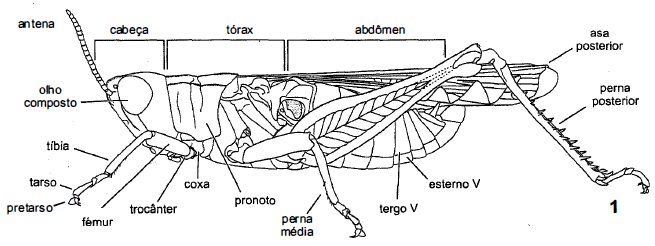
    <figcaption>
        
<b>Figura 1:</b> Morfologia externa. <b>Fonte:</b> Rafael <i>et al.</i>, 2012.

    </figcaption>
</figure>

# Insetos Peçonhentos de Importância Médica

Algumas espécies de insetos produzem toxinas que são utilizadas como defesa contra predadores. Alguns destes, são peçonhentos, pois possuem aparato para inoculação das toxinas, como abelhas, formigas e algumas lagartas (BRASIL, 2024[^3]).

## Ordem Hymenoptera

Os himenópteros são conhecidos popularmente como vespas, abelhas e formigas (MELO & DAL MOLIN, 2024[^4]). Fazem parte das 4 grandes ordens de insetos (juntamente com Coleoptera, Lepidoptera e Diptera), com mais de 150 mil espécies descritas (KLOPFSTEIN *et al.*, 2013[^5]; MELO & DAL MOLIN, 2024). No Brasil, cerca de 11 mil espécies são conhecidas (MELO & DAL MOLIN, 2024). São insetos com importante papel na natureza, seja pela polinização e produção de mel, no caso das abelhas (BRASIL, 2024[^8]), seja pelo controle biológico, no caso de vespas parasitoides. Acidentes com himenópteros podem causar reações locais e sistêmicas, associado principalmente pelo inóculo deixado na pele (abelhas), ferroadas múltiplas (formigas e vespas) ou concentração do veneno (abelhas e vespas) (COSTA *et al*., 2018[^21]).

### Família Apidae

Dentro da família Apidae, destacam-se as abelhas, principalmente as do gênero *Apis*, que são amplamente usadas na produção de mel e cera. No Brasil, as principais abelhas são as Africanizadas, frutos da hibridização da Abelha Europeia (*Apis mellifera mellifera*), trazida por colonos no século 19, que devido ao clima, produzia pouco, com a Abelha Africana (*Apis mellifera scutellata*), trazidas em 1956 da África para Rio Claro, a fim de se executar um programa de melhoramento genético capaz de aumentar a produção de mel no país, associado a uma baixa agressividade (MELLO *et al.*, 2003[^9]; TOLEDO *et al.*, 2006[^10]; ALMEIDA *et al.*, 2011[^11]; GOMES *et al.*, 2025[^12]).

<figure class="base">
    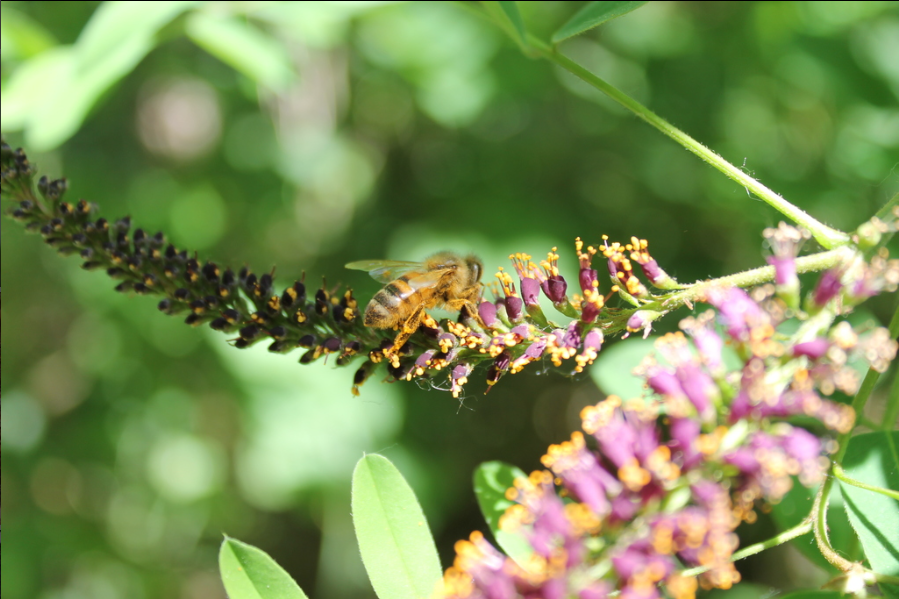Apis mellifera</i>">
    <figcaption>
        
<b>Figura 2:</b> <i>Apis mellifera</i>. <b>Fonte:</b> iNaturalist.<a href="#fn:6">6</a> <b>Autor da imagem:</b> Francesco Cecere.

    </figcaption>
</figure>

As abelhas Africanizadas são mais resistentes ao nosso clima e produzem maior quantidade de mel, quando comparadas às Europeias, porém são mais agressivas, apresentando uma resposta de colmeia defensiva extrema, atacando em grupos, perseguindo a ameaça por distância e tempo maiores e injetando uma quantidade de veneno maior que outras espécies de abelhas (KONO *et al.*, 2021[^13]). Geralmente, ao ferroarem, deixam o ferrão, juntamente com partes do abdômen, ocasionando sua morte.

Acidentes com abelhas podem apresentar manifestações clínicas distintas, dependendo da sensibilidade ao veneno do acidentado e da quantidade de ferroadas (OLIVEIRA *et al.*, 2019[^7]). 

<figure class="base">
    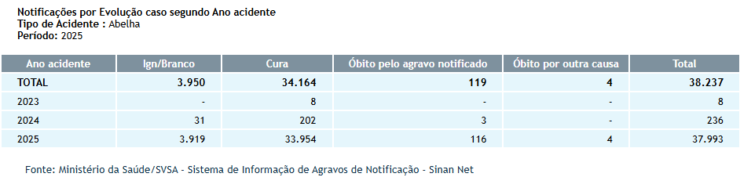
    <figcaption>
        
<b>Figura 3:</b> Notificações de acidentes causados por abelhas. <b>Fonte:</b> Brasil, 2019.<a href="#fn:14">14</a>

    </figcaption>
</figure>

Elas podem ser divididas em Reações locais (inchaço e vermelhidão no local da picada); Reações alérgicas (rinite alérgica, asma brônquica, dermatite atópica e urticária), que podem evoluir para Choque anafilático (colapso cardiovascular, broncoespasmo e hipotensão) e Reações sistêmicas, causadas por múltiplas ferroadas e que pode levar à morte em algumas horas em consequência de falência múltipla de órgãos (KONO *et al.*, 2021).

<figure class="base">
    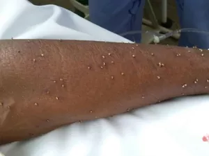
    <figcaption>
        
<b>Figura 4:</b> Ferroadas múltiplas. <b>Fonte:</b> G1, 2017.<a href="#fn:15">15</a> <b>Autor da imagem:</b> Juarez Martins, conforme publicação original.

        <blockquote style="font-size:8px"><i>Imagem de caráter ilustrativo, oriunda de reportagem jornalística, não destinada a diagnóstico clínico.</i></blockquote>
    </figcaption>
</figure>

### Família Fomicidae

As formigas são, claramente, um dos insetos mais conhecidos e reconhecidos no mundo. É a única família de himenópteros onde todas as espécies são eussociais, ou seja, apresentam forte separação em castas (rainha e operárias) e, em algumas espécies, até mesmo subcastas (MELO & DAL MOLIN, 2024). No Brasil, cerca de 2500 espécies de formigas são conhecidas (BRANDÃO, 1999)[^16], dentre as quais destacam-se a Tucandeira ou Formiga-Cabo-Verde (*Paraponera clavata*), que habitam, principalmente a Floresta Amazônica; a Saúva ou Formiga-Cortadeira (*Atta sp.*), com suas grandes mandíbulas capazes de cortar a pele; e a Formiga-de-Fogo, ou como conhecemos na região sudeste, Lava-Pés (*Solenopsis sp.*), cujas ferroadas são capazes de causar graves reações alérgicas (BRASIL, 2024).

<figure class="base">
    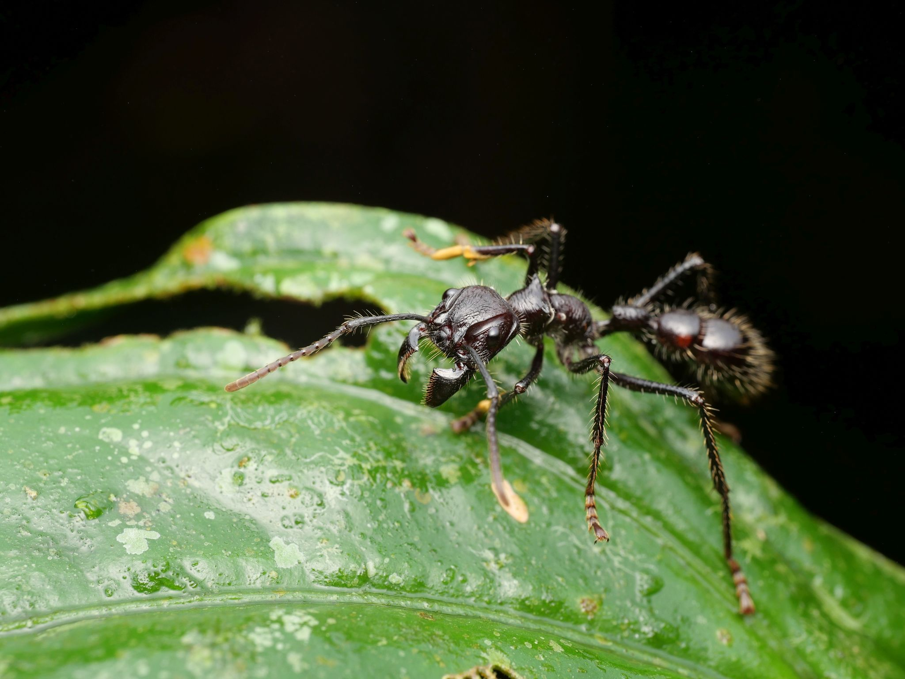Paraponera clavata</i>)">
    <figcaption>
        
<b>Figura 5:</b> Formiga Tucandeira (<i>Paraponera clavata</i>). <b>Fonte:</b> iNaturalist.<a href="#fn:6">6</a> <b>Autor da imagem:</b> Philipp Hoenle.

    </figcaption>
</figure>

<figure class="base">
    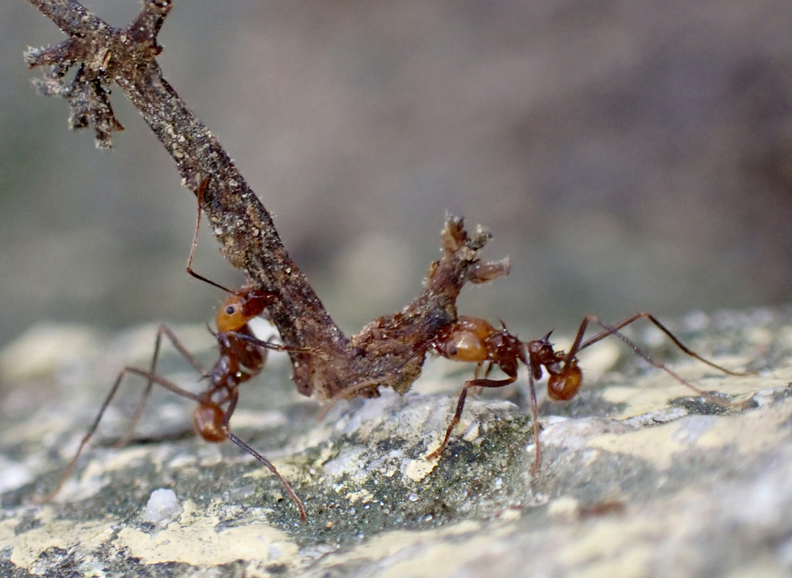Atta sp.</i>)">
    <figcaption>
        
<b>Figura 6:</b> Formiga Saúva (<i>Atta sp.</i>). <b>Fonte:</b> iNaturalist.<a href="#fn:6">6</a> <b>Autor da imagem:</b> Jean-Paul Boerekamps.

    </figcaption>
</figure>

As Lava-pés são originárias do Brasil, Argentina, Uruguai e Paraguai (SOLLEY *et al.*, 2002)[^17], mas se espalharam por diversos países, tornando-se espécie invasora e sendo, até mesmo, consideradas pragas a serem combatidas (JUNIOR & LARSSON, 2015)[^18]. São formigas agressivas, que defendem seu território e faz uso extensivo de feromônios ou sinais químicos para recrutar outras operárias, sincronizar ataques e iniciar as ferroadas, o que resulta em acidentes com grande número de indivíduos e com ferroadas múltiplas (SOLLEY *et al.*, 2002). Geralmente se fixam à pele pelas mandíbulas e ferroam com o aguilhão do abdômen (BRASIL, 2024).

<figure class="base">
    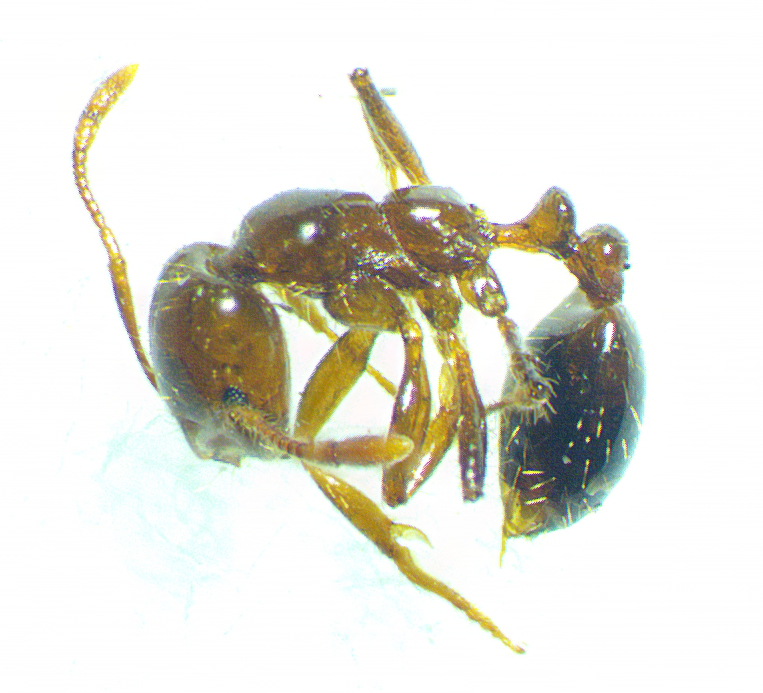Solenopsis sp</i>)">
    <figcaption>
        
<b>Figura 7:</b> Formiga Lava-pé (<i>Solenopsis sp</i>). <b>Fonte:</b> iNaturalist.<a href="#fn:6">6</a>
 <b>Autor da imagem:</b> Ken Kneidel.

    </figcaption>
</figure>

Cerca de 95% do veneno das lava-pés é composto por alcalóides insolúveis. Acidentes com lava-pés podem ocasionar reações locais, geralmente reconhecidas pela reação de pápula-eritematosa, a pústula estéril e a grande reação local; até reações sistêmicas, apresentando urticária generalizada, angioedema, prurido, eritrema e até choque-anafilático em alguns casos (KEMP *et al.*, 2000)[^19].

<figure class="base">
    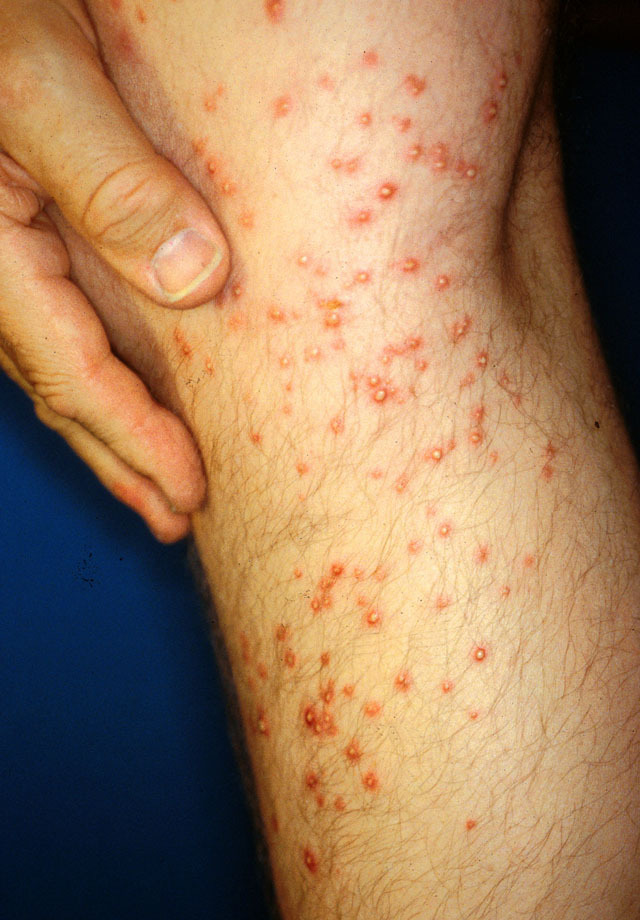
    <figcaption>
        
<b>Figura 8:</b> Lesões causadas por acidente com formigas lava-pés. <b>Fonte:</b> (KRUSE; ANDERSON; SIMON, 2025).<a href="#fn:20">20</a> <b>Autor da imagem:</b> Daniel Wojcik, segundo publicação original.

    </figcaption>
</figure>

### Família Vespidae

Vespidae são chamados popularmente como Vespas e Marimbondos. São amplamente diversificados e cosmopolitas, sendo conhecidas pela agressividade com que defendem seus ninhos e as formas e cores de muitas espécies que são usadas como base para mimetismos de vários outros insetos (MELO & DAL MOLIN, 2024). No Brasil, um dos principais causadores de acidentes são as vespas do gênero *Polistes* (COSTA *et al*., 2018).

<figure class="base">
    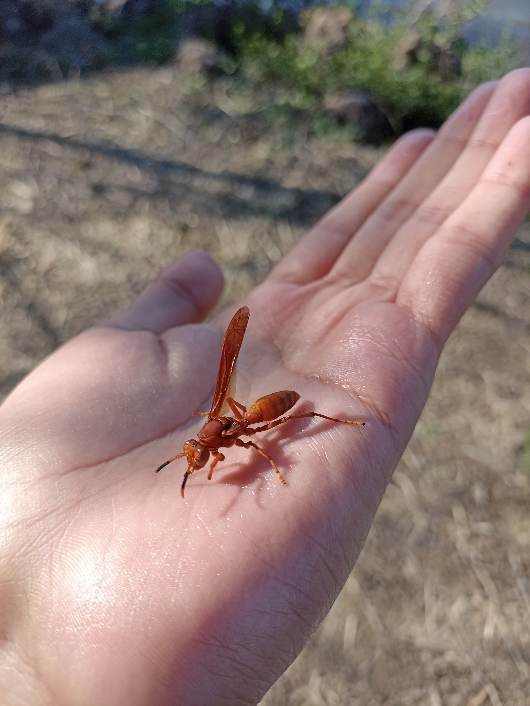Polistes canadensis</i> - Marimbondo-caboclo">
    <figcaption>
        
<b>Figura 9:</b> Marimbondo-caboclo (<i>Polistes canadensis</i>). <b>Fonte:</b> iNaturalist.<a href="#fn:6">6</a> <b>Autor da imagem:</b> Hernán Rodriguez.

    </figcaption>
</figure>

O veneno das vespas contém histaminas, enzimas, neurotoxinas, vasodilatadores e hemolisinas (BADIADKA *et al*., 2017[^23]), fazendo com que acidentes resultem em um espectro de condições clínicas, que variam de reações locais leves a reações sistêmicas fatais com disfunção múltipla de órgãos (RUWANPATHIRANA & PRIYANKARA, 2022[^22]). As principais manifestações incluem dor, coceira, inchaço, eritema, vômito, diarreia, fraqueza muscular, depressão respiratória e convulsões (COSTA *et al*., 2018), podendo evoluir para choque anafilático e óbito.

<figure class="base">
    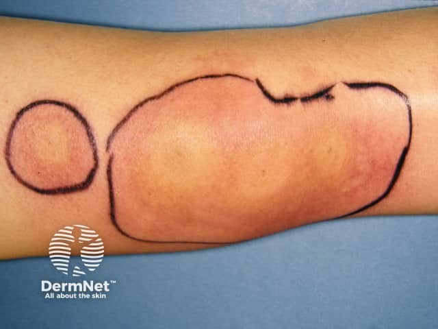
    <figcaption>
	
<b>Figura 10:</b> Lesões causadas por acidente com vespas. <b>Fonte:</b> <a href="https://dermnetnz.org/topics/bee-and-wasp-stings"> DermNet</a>. <b>Autor da imagem:</b> Dra. Beth Wright, conforme publicação original.

    </figcaption>
</figure>

## Ordem Lepidoptera

Os lepidópteros são conhecidos popularmente como lagartas e taturanas (fase larval) e borboletas e mariposas (fase adulta). No Brasil, cerca de 26 mil espécies são conhecidas classificadas em 78 das 124 famílias reconhecidas. São insetos com importante papel na natureza, principalmente pela polinização, mas também economicamente, como no caso do bicho-da-seda (*Bombyx mori*)(CARNEIRO *et al*., 2024[^24]). Acidentes com lepidópteros acontecem principalmente pelo contato com pele humana e podem ser classificados como erucismo (acidente com indivíduos na fase larval) ou lepidopterismo (acidente com indivíduos na fase adulta) (CABRERIZO *et al*., 2014[^25]).

	

		<figure class="base">
		    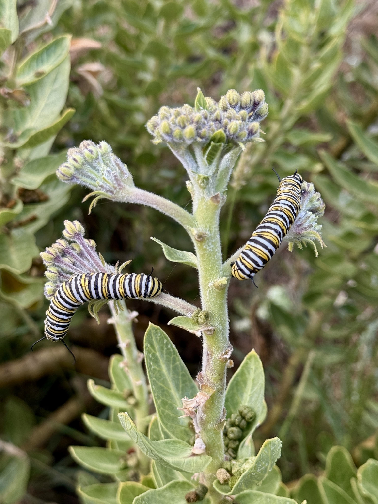
		</figure>
		<figure class="base">
		    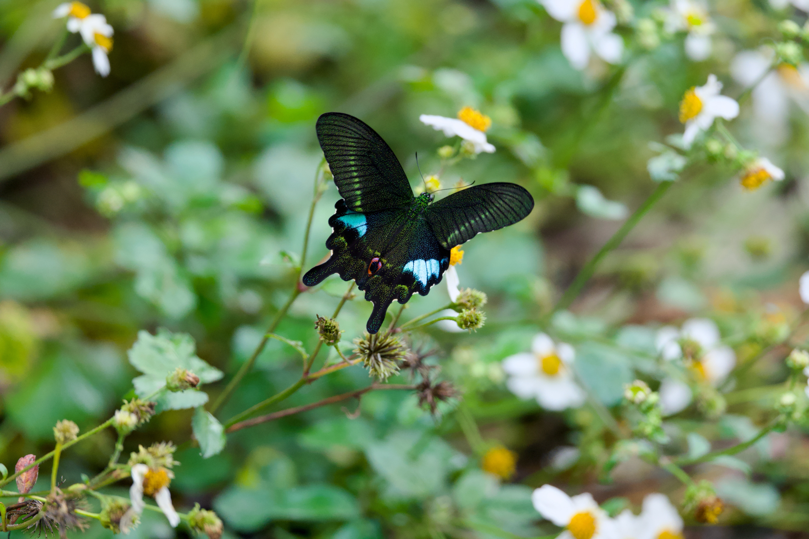
		</figure>
	

	<figcaption style="margin-top: 0.5em; font-size: 0.9em; text-align: center;">
		
<b>Figura 12:</b> Exemplos de lepidópteros. <b>Fonte:</b> iNaturalist.<a href="#fn:6">6</a> <b>Autor da imagem:</b> neotrigonia e Dario Taraborelli.

	</figcaption>

Apesar de muito diversa, apenas duas famílias apresentam importância médica no Brasil: Megalopygidae e Saturniidae (CARNEIRO *et al*., 2024).

### Família Megalopygidae

Os Megalopigídeos são mariposas geralmente de tamanho médio (entre 5 e 8 cm de envergadura, algumas podendo chegar até 11 cm), restritas ao continente americano. As larvas possuem corpo revestido por cerdas densas, a maioria longa, sedosa e não-urticante, porém entre elas há cerdas menores, pontiagudas, robustas e inoculadoras de substâncias urticantes (CARNEIRO *et al*., 2024). 

<figure class="base">
    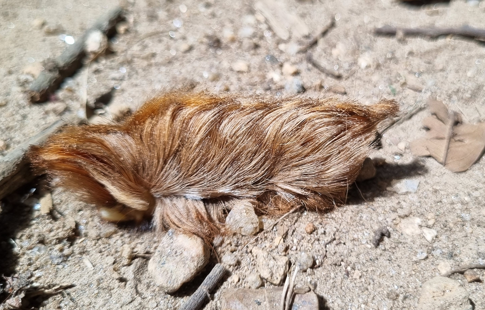Podalia sp.</i> (Megalopygidae)">
    <figcaption>
        
<b>Figura 13:</b> <i>Podalia sp.</i> (Megalopygidae). <b>Fonte:</b> iNaturalist.<a href="#fn:6">6</a> <b>Autor da imagem:</b> Maike Reis Casimiro.

    </figcaption>
</figure>

O contato com as cerdas urticantes causa dor intensa e ardente quase imediatamente, além de eritrema ou erupção cutânea. Em algumas horas, vesículas hemorrágicas ou pústulas aparecem e podem durar por dias. Pode causar dormência na área afetada, dor de cabeça, febre, náuseas, vômitos e dor abdominal, que podem durar vários dias (FORRESTER, 2018[^26]).

### Família Satuniidae

Os Saturniídeos são mariposas geralmente grandes, com espécies podendo chegar aos 30 cm de envergadura. A maioria têm hábitos noturnos e são reconhecidas cerca de 488 espécies no Brasil (CARDOSO *et al*., 2024). Diferentemente dos megalopigídeos, nos saturniídeos, as estruturas inoculadoras de veneno são ramificadas, possuindo um eixo central com ramificações laterais (BRASIL, 2024).

<figure class="base">
    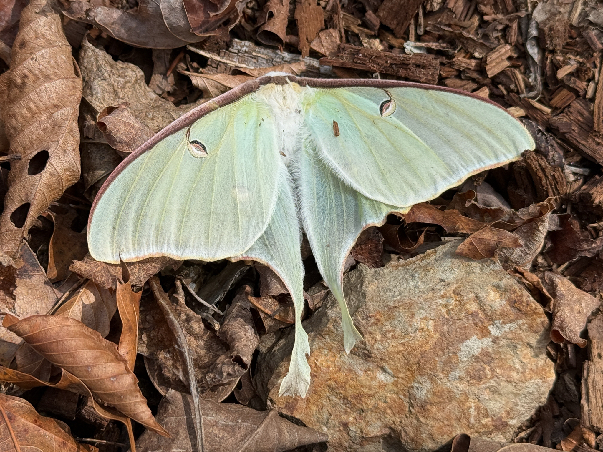Actias luna</i> (Saturniidae)">
    <figcaption>
        
<b>Figura 14:</b> <i>Actias luna</i> (Saturniidae). <b>Fonte:</b> iNaturalist.<a href="#fn:6">6</a> <b>Autor da imagem:</b> Brian O'Meara.

    </figcaption>
</figure>

O contato com cerdas urticantes causam queimação imediata e inchaço local, com complicações clínicas, às vezes, fatais aos humanos, como é o caso de *Lonomia obliqua*. Também são conhecidos os acidentes provocados por algumas espécies de Hylesia, as fêmeas adultas possuem cerdas microscópicas no abdômen que, em contato com a pele humana, podem provocar reações inflamatórias papulosas e pruriginosas intensas, semelhantes às observadas em acidentes por cerdas de aranhas caranguejeiras (CARDOSO & HADDAD JR, 2005[^27]; CARNEIRO *et al*., 2024).

<figure class="base">
    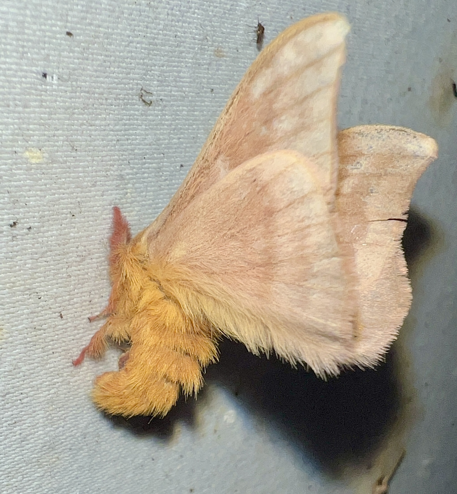Hylesia sp.</i>">
    <figcaption>
        
<b>Figura 15:</b> Exemplo de <i>Hylesia sp</i>. <b>Fonte:</b> iNatualist.<a href="#fn:6">6</a><b> Autor da imagem:</b> henrya.

    </figcaption>
</figure>

Os casos mais severos de erucismo são os causados pelo contato com indivíduos do gênero *Lonomia*, que podem levar a uma síndrome hemorrágica, caracterizada por equimoses (manchas roxas), hematúria, sangramento das mucosas, hemorragia intracerebral e insuficiência renal aguda. As larvas de *Lonomia* têm hábito gregário, vivendo em colônias sobre troncos de árvores (VEIGA, 2005[^28]). A maioria dos acidentes ocorre com homens, principalmente nos membros superiores, em atividades ao ar livre, tanto em áreas rurais, quanto urbanas (FAVALESSO *et al*., 2023[^29]).

	<figure class="base">
	    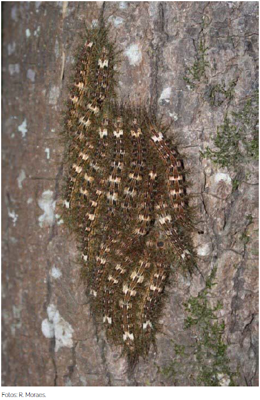Lonomia obliqua</i> envidenciando seu comportamento gregário" style="width: 50%">
	    <figcaption>
	        
<b>Figura 16:</b> Colônia de <i>Lonomia obliqua</i> envidenciando seu comportamento gregário. <b>Fonte:</b> Brasil, 2024.

	    </figcaption>
	</figure>
	<figure class="base">
	    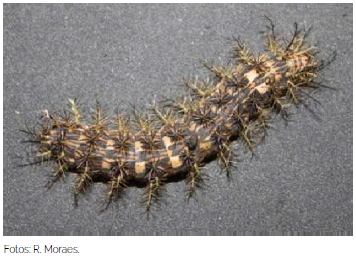Lonomia obliqua</i>">
	    <figcaption>
	        
<b>Figura 17:</b> Exemplo de <i>Lonomia obliqua</i>. <b>Fonte:</b> Brasil, 2024.

	    </figcaption>
	</figure>

# Menções honrosas

No Brasil, temos também outros insetos, não peçonhentos, mas que podem causar acidentes mais leves, principalmente pelo contato direto ou manipulação inadvertida.

## Coleoptera

Conhecidos popularmente como besouros, é o maior e mais diverso grupo de organismos do reino Animal, com cerca de 380 mil espécies descritas (cerca de 35% do total de insetos). No Brasil, são cerca de 33 mil espécies em 115 famílias (CASARI *et al*., 2024[^31]). Dessas famílias, apenas 3 serão citadas aqui: Cerambycidae, Meloidae e Staphylinidae.

### Cerambycidae

Conhecidos popularmente como arlequim e serra-pau, são reconhecidos pelas antenas longas, forma geralmente alongada e coloração geralmente castanha ou com cores brilhantes. Com comprimentos variando de 3mm a 200mm, a família inclui os maiores besouros conhecidos (CASARI *et al*., 2024). Alguns desses besouros possuem estruturas bucais robustas e podem desferir fortes mordidas como forma de defesa.

	<figure class="base">
	    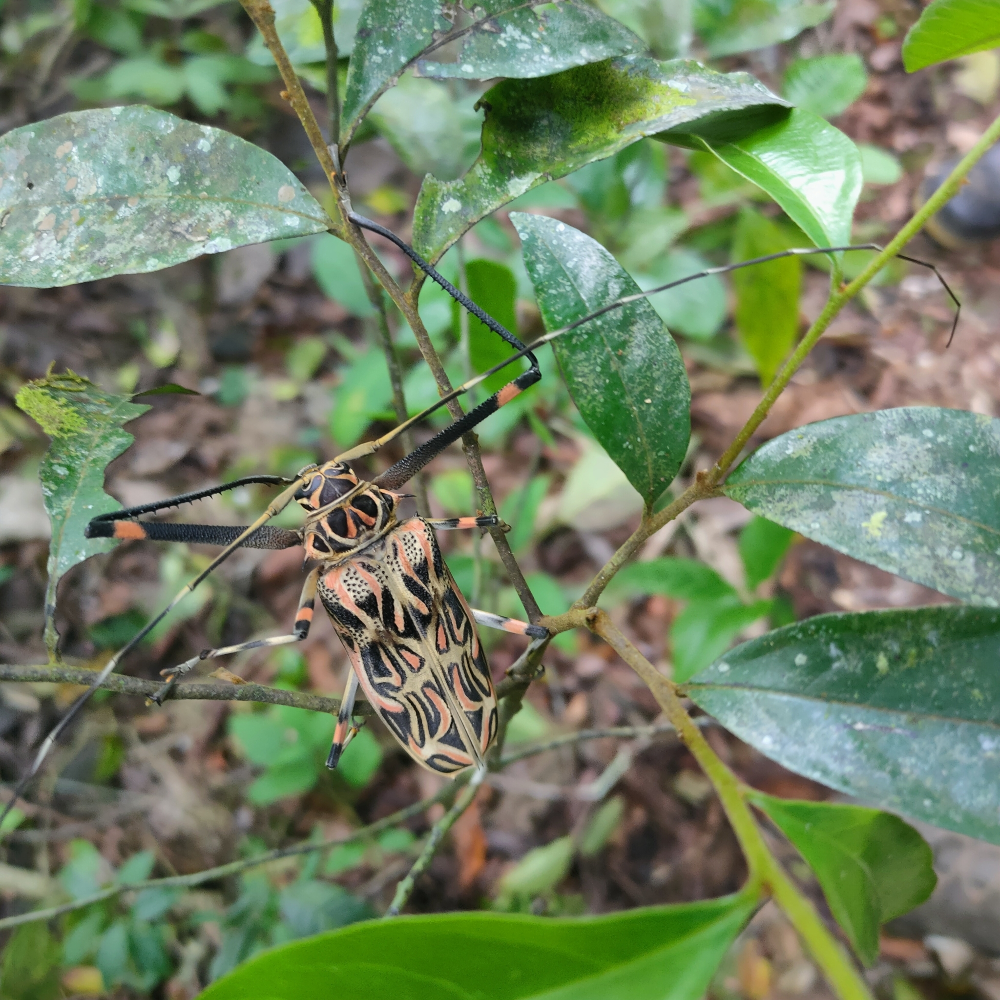Acrocinus longimanus</i>).">
	    <figcaption>
	        
<b>Figura 18:</b> Arlequim-da-mata (<i>Acrocinus longimanus</i>).. <b>Fonte:</b> iNaturalist.<a href="#fn:6">6</a> <b>Autor da imagem:</b> Daniel Moreno.

	    </figcaption>
	</figure>
    <figure class="base">
        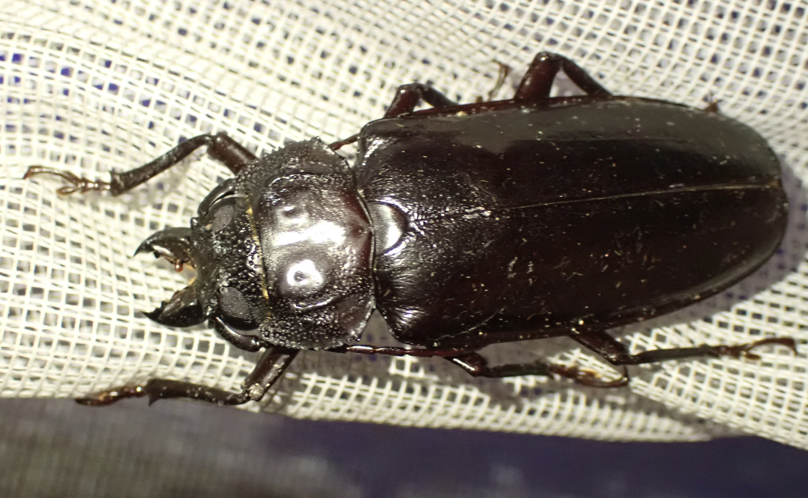Mallodon spinibarbis</i>. Detalhe para as peças bucais robustas">
        <figcaption>
            
<b>Figura 19:</b> <i>Mallodon spinibarbis</i>. Detalhe para as peças bucais robustas. <b>Fonte:</b> iNaturalist.<a href="#fn:6">6</a> <b>Autor da imagem:</b> Jean-Paul Boerekamps.

        </figcaption>
    </figure>

### Meloidae

Conhecidos popularmente como burrinho, caga-fogo e potó grande, são reconhecidos pelo corpo mole, alongado, pernas longas e cabeça maior que o protórax, com coloração de opaca a metálica ou colorida de vermelho ou amarelo e preto (coloração de alerta). Os machos adultos de meloídeos produzem uma substância defensiva e vesicante forma bolhas chamado cantaridina que é eliminada quando perturbados. Essa substância é transferida para as fêmeas durante a cópula e está presente nas larvas. Ela pode causar bolhas externas ou hemorragias internas se ingerida por humanos ou animais (CASARI *et al*., 2024).

    <figure class="base">
        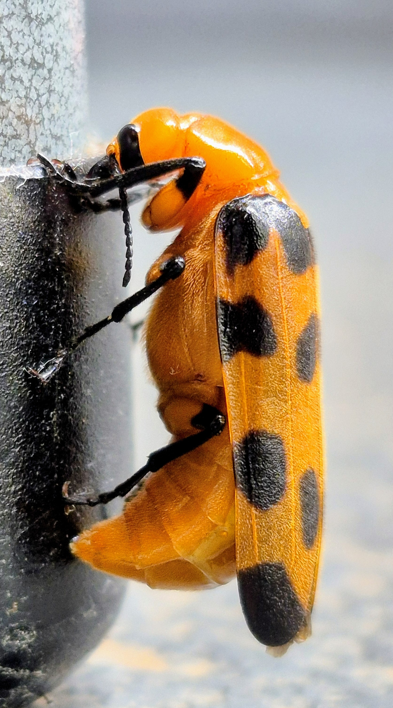Cissites maculata</i>)">
        <figcaption>
            
<b>Figura 20:</b> Arrebenta-boi (<i>Cissites maculata</i>). <b>Fonte:</b> Imagem autoral.

        </figcaption>
    </figure>
    <figure class="base">
        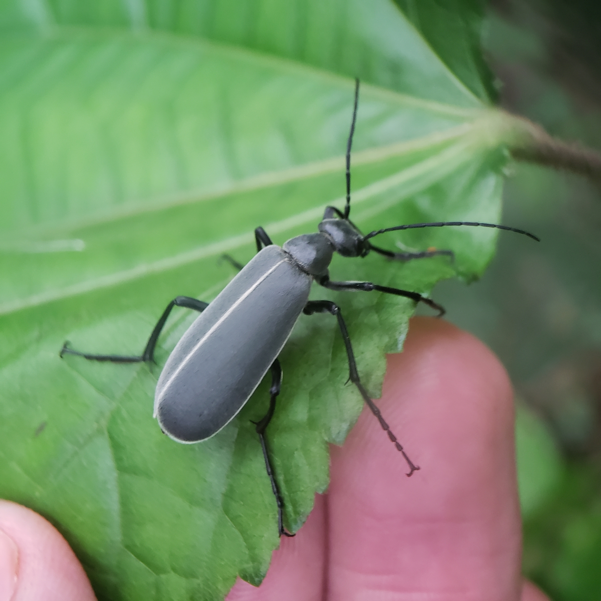Epicauta suturalis</i>)">
        <figcaption>
            
<b>Figura 21:</b> Caga-fogo (<i>Epicauta suturalis</i>). <b>Fonte:</b> iNaturalist.<a href="#fn:6">6</a> <b>Autor da imagem:</b> Alex Fernando.

        </figcaption>
    </figure>

### Staphylinidae

Conhecidos popularmente como potó e caga-fogo, é a segunda maior família de Coleoptera. São muito variáveis na forma, mas podem ser reconhecidos pelo corpo compacto, entre 1mm e 40mm, geralmente alongado, com élitros geralmente curtos e truncados, expondo o abdômen. Têm coloração negra ou castanha, em sua maioria, com alguns amarelados, castanho-avermelhados, metálicos ou com padrões coloridos. Também secretam substância vesicante quando perturbados, podenco causar eritema, prurido, vesiculação e ulceração (CASARI *et al*., 2024).

    <figure class="base">
        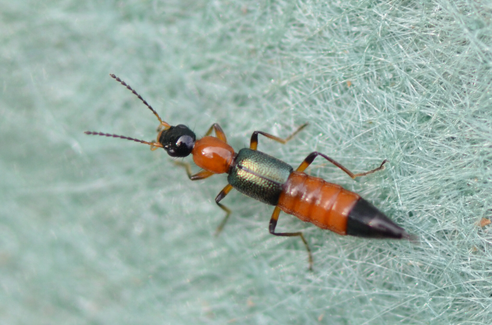Paederus</i>)">
        <figcaption>
            
<b>Figura 22:</b> Potó (gênero <i>Paederus</i>). <b>Fonte:</b> iNaturalist.<a href="#fn:6">6</a> <b>Autor da imagem:</b> ruebezahl.

        </figcaption>
    </figure>
    <figure class="base">
        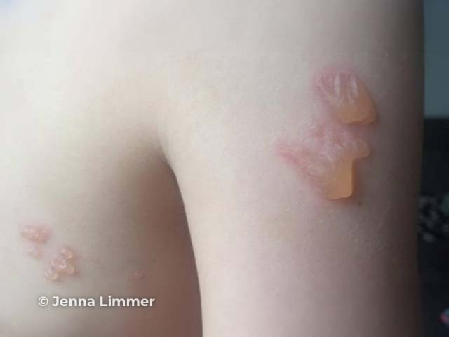
        <figcaption>
            
<b>Figura 23:</b> Acidente causado por potó. <b>Fonte:</b> <a href="https://dermnetnz.org/imagedetail/15295-blistering-due-to-blister-beetle"> DermNet</a>
            <b>Autor da imagem:</b> Jenna Limmer.

        </figcaption>
    </figure>

## Hemiptera

A ordem Hemiptera é tão diversa que recebe vários nomes populares, de acordo com a subordem. São conhecidas mais 106 mil espécies, distribuídas em 4 subordens. Das 4, apenas 3 são descritas no Brasil. Podem ser reconhecidos principalmente pelo aparelho bucal picador-sugador (GRAZIA *et al*., 2024[^32]). 

### Belostomatidae

Popularmente conhecidas como baratas-d'água, são grandes, variando de 10mm a 130mm. Sua forma corporal varia de oval a alongada e achatada dorso-ventralmente. Possui coloração que varia de verde a castano. São facilmente reconhecidas pela perna anterior raptorial e as médias e posteriores em forma de remo, adaptadas para natação. Bons nadadores, predadores de tocaia, podendo predar peixes e anfíbios maiores que eles mesmos (GRAZIA *et al*., 2024). Habitam águas paradas e lentas e podem migrar para piscinas, atraídos por fontes luminosas. Eventualmente desferem picadas em pessoas que entram nesses corpos d'água (BRASIL, 2024).

<figure class="base">
    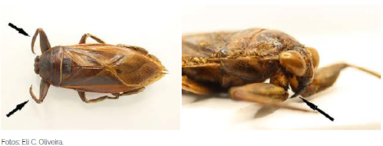Belostoma sp</i>. Vistas dorsal e lateral. Detalhe para as pernas raptoriais e peça bucal picadora-sugadora">
    <figcaption>
        
<b>Figura 24:</b> Barata d'água (<i>Belostoma sp</i>). Vistas dorsal e lateral. Detalhe para as pernas raptoriais e peça bucal picadora-sugadora. <b>Fonte:</b> Brasil, 2024.

    </figcaption>
</figure>

### Reduviidae

Popularmente conhecidos como barbeiros, é considerada a segunda maior família de Hemiptera, com cerca de 7000 espécies (cerca de 11% dessas, descritas no Brasil). Todos são predadores de outros artrópodes, com exceção dos triatomíneos, que são hematófagos. Estes, são considerados de importância médica por serem vetores do protozoário *Tripanossoma cruzi*, causador da Doença de Chagas. Estudos mostram que a Doença de Chagas já existia como uma doença de animais silvestres há milhões de anos, mas a perda do hábitat natural dos triatomíneos, fez com que algumas espécies desses insetos passassem a viver em habitações humanas, causando acidentes (GRAZIA *et al*., 2024).

<figure class="base">
    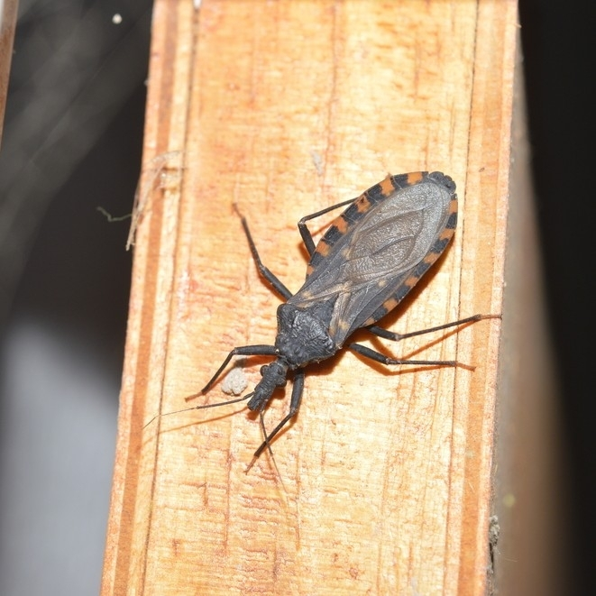Triatoma infestans</i>)">
    <figcaption>
        
<b>Figura 25:</b> Barbeiro (<i>Triatoma infestans</i>). <b>Fonte:</b> iNaturalist.<a href="#fn:6">6</a> <b>Autor da imagem:</b> Evaristo Santos Ortega.

    </figcaption>
</figure>

## Diptera

Conhecidos popularmente como moscas, mosquitos, mutucas, pernilongos, entre outros, dependendo do grupo, é uma das quatro ordens megadiversas de insetos. São reconhecidas por um par de asas (segundo par reduzido a halteres), adultos com peças bucais sugadoras, frequentemente adaptadas para perfurar. No Brasil, são descritas cerca de 11800 espécies, muitas delas, de importância médica, veterinária ou agrícola, seja por serem vetores de doenças ou pragas de plantações (CARVALHO *et al*., 2024[^33]). 

    <figure class="base">
        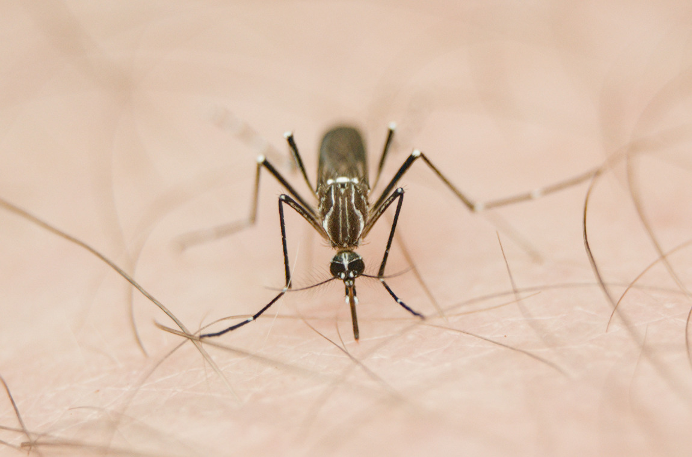Aedes aegypti</i>)">
        <figcaption>
            
<b>Figura 26:</b> Mosquito-da-dengue (<i>Aedes aegypti</i>). <b>Fonte:</b> iNaturalist.<a href="#fn:6">6</a> <b>Autor da imagem:</b> schneepschnorp.

        </figcaption>
    </figure>
    <figure class="base">
        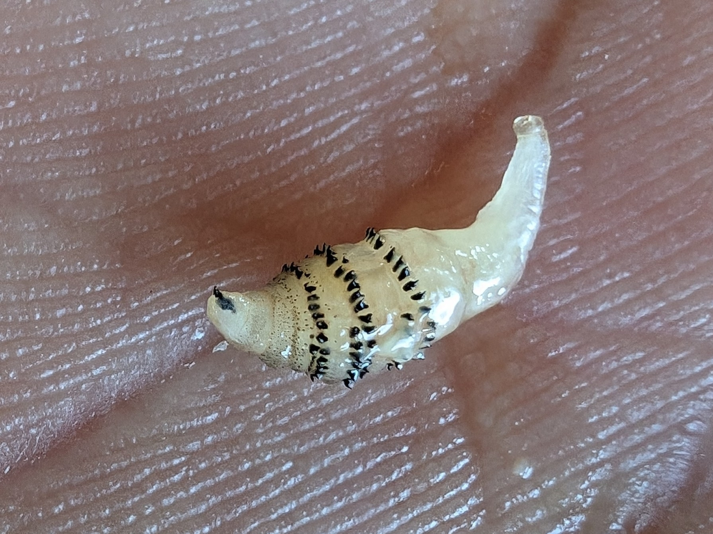Dermatobia hominis</i>)">
        <figcaption>
            
<b>Figura 27:</b> Berne (fase larval da Mosca <i>Dermatobia hominis</i>). <b>Fonte:</b> iNaturalist.<a href="#fn:6">6</a> <b>Autor da imagem:</b> Zac Peterson.

        </figcaption>
    </figure>

# Prevenção e Primeiros-Socorros em caso de acidente

## Introdução

Conhecer o agente, a causa e as circunstâncias de acidentes que já aconteceram é imprescindível para que saibamos as melhores formas de prevenir que ocorram novamente. Tratando-se de acidentes com insetos, a maioria ocorre em áreas urbanas. As regiões mais atingidas são os membros superiores (COSTA *et al*., 2018), independente da idade ou sexo (ARIF & WILLIAMS, 2023[^30]).

## Prevenção de acidentes

Com base nessas informações, as principais ações para prevenir acidentes são:
- **Atenção:** Olhar com atenção onde pisa e/ou coloca a mão, principalmente em troncos de árvores (no caso de colmeias de abelhas e vespas ou de colônias de lagartas) ou gramados (no caso de ninhos de formigas);
- **Uso de EPI:** Usar sapatos fechados, luvas de aparas de couro e macacão para apicultura;
- **Manutenção:** Não mexer em colmeias e vespeiros. Em caso de risco de acidente, contatar a autoridade local ou profissional qualificado competente para remoção;
- **Limpeza:** A remoção de colmeias, sejam de abelhas ou vespas, deve ser efetuada por profissionais devidamente treinados e equipados, preferencialmente à noite ou entardecer.

## Primeiros-socorros

Em casos de acidentes com himenópteros, o que se **DEVE** fazer:

- Procurar atendimento médico mais próximo;
- Se possível, levar o animal para identificação;
- Em caso de acidente com abelhas, a remoção dos ferrões pode ser feita por raspagem com lâmina, evitando retirá-los com pinça ou dedos, pois provocam a compressão dos reservatórios de veneno, podendo inocular veneno ainda existente no ferrão.

Em casos de acidentes com lepidópteros, o que se **DEVE** fazer:

- Se possível, lavar imediatamente a área afetada com água e sabão;
- Usar compressas de com gelo ou água gelada auxiliam no alívio da dor;
- Procurar atendimento médico mais próximo;
- Se possível, levar o animal para identificação.

O que **NÃO** fazer:

- Não aplicar torniquete ou garrote no membro acometido;
- Não cortar, queimar, espremer ou aplicar qualquer tipo de substância, tais como borra de café, álcool, terra, folhas, fezes, urina, entre outros no local da picada;
- Não fazer curativo no local da picada, pois pode favorecer a ocorrência de infecção;
- Não dar bebidas alcoólicas ou outros líquidos como gasolina ou querosene à vitima, pois podem causar problemas gastrointestinais, além de não terem efeito contra a peçonha;
- Não tentar chupar o veneno, pois pode favorecer a ocorrência de infecção.

# Conclusão

Apesar de a maioria dos acidentes com insetos serem autolimitadas, resultando em uma pequena área de inflamação local que desaparecem em poucos dias, algumas reações podem ser maiores, mais dolorosas e permanecerem por mais tempo, necessitando intervenção médica. Reações sistêmicas são menos comuns, mas podem ser fatais (ARIF & WILLIAMS, 2018). Por isso é muito importante que, em caso de acidente, se possível, apresentar o animal que o causou, seja por fotografia ou o próprio animal. Neste caso, a conservação do animal pode ser feita pela imersão em álcool comum, em recipiente apropriado, com dados do local do acidente para ser encaminhado para identificação correta (BRASIL, 2024).

---
[^1]: RAFAEL, J.A.(ed.). **Insetos do Brasil: diversidade e taxonomia**. Ribeirão Preto: Holos Editora, 2012. 810 p. ISBN 978-85-86699-72-6.

[^2]: ALMEIDA, E.A.B.; MELO, G.A.R. Cap. 1, Morfologia Externa, pp.1-11. In: RAFAEL, J.A.; MELO, G.A.R.; CARVALHO, C.J.B. de; CASARI, S. & CONSTANTINO, R. (eds). **Insetos do Brasil: Diversidade e Taxonomia**. 2ª ed. Instituto Nacional de Pesquisas da Amazônia, Manaus. 880 pp. ISBN: 978-65-5633-046-4. DOI: https://doi.org/10.61818/56330464.

[^3]: BRASIL. Ministério da Saúde. Secretaria de Vigilância em Saúde e Ambiente. Departamento de Doenças Transmissíveis. **Guia de Animais Peçonhentos do Brasil**. Brasília, 2024. 164 p.  

[^4]: MELO, G.A.R.; DAL MOLIN, A. 2024. Cap. 27, Hymenoptera Linnaeus, 1758, pp. 484-545. In: RAFAEL, J.A.; MELO, G.A.R.; CARVALHO, C.J.B. de; CASARI, S. & CONSTANTINO, R. (eds). **Insetos do Brasil: Diversidade e Taxonomia**. 2ª ed. Instituto Nacional de Pesquisas da Amazônia, Manaus. 880 pp. ISBN: 978-65-5633-046-4. DOI: https://doi.org/10.61818/56330464.

[^5]: KLOPFSTEIN, S.; VILHELMSEN, L.; HERATY, J.M.; SHARKLEY, M.; RONQUIST, F. The Hymenopteran Tree of Life: Evidence from Protein-Coding Genes and Objectively Aligned Ribossomal Data. **PLoS One**, v. 8, 2013. DOI: https://doi.org/10.1371/journal.pone.0069344. Disponível em: https://pmc.ncbi.nlm.nih.gov/articles/PMC3732274/. Acesso em: 07 jan. 2026.

[^6]: INATURALIST. iNaturalist: plataforma de ciência cidadã para registro de biodiversidade. [S.l.]: iNaturalist, s.d. Disponível em: https://www.inaturalist.org/. Acesso em: 06 jan. 2026.

[^7]: OLIVEIRA, S.K.; TREVISOL, D.J.; PARMA, G.C.; JÚNIOR, R.S.F.; BARBOSA, A.N.; BARRAVIERA, B.; SHUELTER-TREVISOL, F. Honey bee envenoming in Santa Catarina, Brazil, 2007 through 2017: an observational, retrospective cohort study. **Revista da Sociedade Brasileira de Medicina Tropical**, v. 52, 2019. DOI: https://doi.org/10.1590/0037-8682-0418-2018. Disponível em: https://www.scielo.br/j/rsbmt/a/mtB7d7PXSDyPM5F7g84gJ9C. Acesso em: 15 jan. 2026.

[^8]: BRASIL. Ministério da Saúde. Secretaria de Vigilância em Saúde e Ambiente. Departamento de Doenças Transmissíveis. **Guia de Animais Peçonhentos do Brasil**. Brasília, 2024. 164 p.

[^9]: MELLO, M.H.S.H.; SILVA, E.A.; NATAL, D. Abelhas africanizadas em área metropolitana do Brasil: abrigos e influências climáticas. **Revista de Saúde Pública**, v. 37, 2003. DOI: https://doi.org/10.1590/S0034-89102003000200012. Disponível em: https://www.scielo.br/j/rsp/a/fXCZgLBJSPZ4BYcSfYtsjZC. Acesso em: 15 jan. 2026.

[^10]: TOLEDO; V.A.A.; TORAL, F.L.B.; MIRANDA, S.B.; HASHIMOTO, J.H.; SILVA, W.R. Ocorrência e coleta de colônias e de enxames de abelhas africanizadas na zona urbana de Maringá, Estado do Paraná, Brasil. **Acta Scientarum. Animal Sciences**, v. 28, n. 3, p. 353-359. 2007. DOI: https://doi.org/10.4025/actascianimsci.v28i3.53. Disponível em: https://periodicos.uem.br/ojs/index.php/ActaSciAnimSci/article/view/53/19. Acesso em: 15 jan. 2026.

[^11]: ALMEIDA, R.A.M.B.; OLIVO, T.E.T.; MENDES, R.P.; BARRAVIERA, S.R.C.S.; SOUZA, L.R.; MARTINS, J.G.; HASHIMOTO, M.; FABRIS, V.E.; JUNIOR, R.S.F.; BARRAVIERA, B. Africanized honeybee stings: how to treat them. **Revista da Sociedade Brasileira de medicina Tropical**, v. 46, n. 6. 2011. DOI: https://doi.org/10.1590/S0037-86822011000600020. Disponível em: https://www.scielo.br/j/rsbmt/a/kfT6PJqFyjhVqhSQPPThxgd. Acesso em: 15 jan. 2026.

[^12]: GOMES, M.D.S.; PINHEIRO, R.S.; SILVA, P.R.R.; JÚNIOR, T.C.S.; BENDINI, J.N. Africanized bee (Hymenoptera: Apidae) sting accidents and honey production: An epidemiological analysis in the state of Piauí (2014-2023). **Revista Brasileira de Saúde e Produção Animal**, v. 26, 2025. DOI: https://doi.org/10.1590/20250008. Disponível em: https://www.scielo.br/j/rbspa/a/PP8PX5GKFBRX6GGPC5Tshtp. Acesso em: 15 jan. 2026.

[^13]: KONO, I.S.; FREIRE, R.L.; CALDART, E.T.; RODRIGUES F.S.; SANTOS, J.A.; FREIRE, L.G.D.; FACCIN, T.C. Bee stings in Brazil: Epidemiological aspects in humans. **Toxicon**, v. 201, n. 15, p. 59-65, 2021. DOI: https://doi.org/10.1016/j.toxicon.2021.08.014. Disponível em: https://www.sciencedirect.com/science/article/abs/pii/S0041010121002257. Acesso em: 15 jan. 2026.

[^14]: BRASIL. Ministério da Saúde. Sistema de Informação de Agravos de Notificação - Sinan Net. Brasília: Ministério da Saúde, 16 abr. 2019. Disponível em: http://tabnet.datasus.gov.br/cgi/deftohtm.exe?sinannet/cnv/animaisbr.def. Acesso em: 07 dez. 2025.

[^15]: G1. Idosa de 84 anos é picada por cerca de 500 abelhas em Presidente Olegário. G1 Triângulo Mineiro, 13 mar. 2017. Disponível em: https://g1.globo.com/minas-gerais/triangulo-mineiro/noticia/2017/03/idosa-de-84-anos-e-picada-por-cerca-de-500-abelhas-em-presidente-olegario.html. Acesso em: 29 dez. 2025.

[^16]: BRANDÃO, C.R.F. 1999. Formicidae, p. 213-223. In: BRANDÃO, C.R.F. & CANCELLO, E.M. (eds.). **Invertebrados Terrestres**, Vol. 7. São Paulo, FAPESP, 279 p.

[^17]: SOLLEY, G.O.; VANDERWOUDE, C.; KNIGHT, G.K. Anaphylaxis due to Red Imported Fire Ant sting. **Medical Journal of Australia**, v. 11; p. 521-523, 2002. DOI: https://doi.org/10.5694/j.1326-5377.2002.tb04548.x. Disponível em: https://www.mja.com.au/journal/2002/176/11/anaphylaxis-due-red-imported-fire-ant-sting. Acesso em: 26 jan. 2026.

[^18]: JUNIOR, V.H.; LARSSON, C.E. Anaphylaxis caused by stings from the *Solenopsis invicta*, lava-pés ant or red imported fire ant. **Anais Brasileiros de Dermatologia**, v. 90, 2015. DOI: https://doi.org/10.1590/abd1806-4841.20153420. Disponível em: https://www.scielo.br/j/abd/a/VtBDTnSr6GKgbSW3j3ZLMNh. Acesso em: 26 jan. 2026.

[^19]: KEMP, S.F., DESHAZO, R.D.; MOFFITT, J.E.; WILLIAMSM D.F.; BUHNER, W.A. Expandind habitat of the imported fire ant (Solenopsis invicta): A public health concern. **Journal of Allergy anc Clinaical Immunology**, v. 105, nº 4, p. 683-691, 2000. DOI: https://doi.org/10.1067/mai.2000.105707. Disponível em: https://www.sciencedirect.com/science/article/abs/pii/S009167490066462X. Acesso em: 26 jan. 2026.

[^20]: KRUSE, B.; ANDERSON, J.; SIMON, L.V. Fire ant bites. In: STATPEARLS [Internet]. Treasure Island (FL): StatPearls Publishing, 2025 Jan-. Disponível em: https://www.ncbi.nlm.nih.gov/books/NBK470576/. Acesso em: 26 jan. 2026.

[^21]: COSTA, A.G.; CHAVES, B.A.; MURTA, F.L.G.; SACHETT, J.A.G.; SAMPAIO, V.S.; SILVA, V.C.; MONTEIRO, W.M. Hymenoptera stings in Brazil: a neglected health threat in Amazonas State. **Revista da Sociedade Brasileira de Medicina Tropical**, v. 51, n. 1, 2018. DOI: https://doi.org/10.1590/0037-8682-0109-2017. Disponível em: https://www.scielo.br/j/rsbmt/a/pkTb7DdwXSnL5HMSpJCY8Xb. Acesso em: 28 jan. 2026.

[^22]: RUWANPATHIRANA, P.; PRIYANKA, D. Clinical manifestations of wasp stings: a case report and a review of literature. **Tropical Medicine and Health**, v. 50, n. 82, 2022. DOI: [10.1186/s41182-022-00475-8.](https://doi.org/10.1186/s41182-022-00475-8). Disponível em: https://pmc.ncbi.nlm.nih.gov/articles/PMC9615201/. Acesso em: 28 jan. 2026.

[^23]: BADIADKA, K.K.; AMIR, S.; PRAMOD, K.L. Wasp Sting Envenomation - A Case Report. **Forensic Research & Criminology International Journal**, v. 4, p. 181-184, 2017. DOI: https://doi.org/10.15406/frcij.2017.04.00135. Disponível em: https://medcraveonline.com/FRCIJ/wasp-sting-envenomation---a-case-report.html. Acesso em: 28 jan. 2026.

[^24]: CARNEIRO, E.; MARCONATO, G.; SPECHT, A.; DUARTE, M.; CASAGRANDE, M.M. 2024. Cap. 33, Lepidoptera Linnaeus, 1758, pp. 710-766. In: RAFAEL, J.A.; MELO, G.A.R.; CARVALHO, C.J.B. de; CASARI, S. & CONSTANTINO, R. (eds). **Insetos do Brasil: Diversidade e Taxonomia**. 2ª ed. Instituto Nacional de Pesquisas da Amazônia, Manaus. 880 pp. ISBN: 978-65-5633-046-4. DOI: https://doi.org/10.61818/56330464.

[^25]: CABRERIZO, S.; SPERA, M.; ROODT, A. de. Accidentes por lepidópteros: *Hylesia nigricans* (Berg, 1875) o "mariposa negra". **Archivos Argentinos de Pediatría**, v. 112, p. 179-182, 2014. Disponível em: https://www.sap.org.ar/docs/publicaciones/archivosarg/2014/v112n2a17.pdf. Acesso em: 24 mar. 2026.

[^26]: FORRESTER, M.B. Megalopyge opercularis Catterpillar Stings Reported to Texas Poison Centers. **Wilderness & Environmental Medicine**, v. 39, p. 215-220, 2018. DOI: https://doi.org/10.1016/j.wem.2018.02.002. Disponível em: https://journals.sagepub.com/doi/10.1016/j.wem.2018.02.002. Acesso em: 24 mar. 2026.

[^27]: CARDOSO, A.E.C.; HADDAD JR, V. Accidents caused by lepidopterans (moth *larvae* and adult): study on the epidemiological, clinical and therapeutic aspects. **Anais Brasileiros de Dermatologia**, v. 80. p. 573-578, 2005. Disponível em: https://repositorio.unesp.br/server/api/core/bitstreams/f863d2b8-7e90-4ba0-ae25-999d8e5b4ab2/content. Acesso em: 25 mar. 2026.

[^28]: VEIGA, A.B.G. _Caracterização molecular dos componentes do veneno de Lonomia obliqua: genes expressos e princípios ativos envolvidos nos distúrbios da coagulação e da fibrinólise_. 2005. 118f. Tese (Doutorado em Biologia Celular e Molecular) – Universidade Federal do Rio Grande do Sul, Porto Alegre, 2005. Disponível em: [https://lume.ufrgs.br/bitstream/handle/10183/6566/000531846.pdf](https://lume.ufrgs.br/bitstream/handle/10183/6566/000531846.pdf). Acesso em: 25 mar. 2026.

[^29]: FAVALESSO, M.M.; VALENTIM, M.; GUIMARÃES, A.T.B.; PEICHOTO, M.E. Epidemiological characterization of lonomism in South America. **Acta Tropica**, v. 238, 2023. DOI: https://doi.org/10.1016/j.actatropica.2022.106777. Disponível em: https://www.sciencedirect.com/science/article/abs/pii/S0001706X22004685. Acesso em: 25 mar. 2026.

[^30]: ARIF, F.; WILLIAMS, M. _Hymenoptera stings_ [Internet]. In: _StatPearls_ [Internet]. Treasure Island (FL): StatPearls Publishing, 2026–. Atualizado em: 20 jun. 2023. Disponível em: [https://www.ncbi.nlm.nih.gov/books/NBK518972/](https://www.ncbi.nlm.nih.gov/books/NBK518972/). Acesso em: 06 abr. 2026.

[^31]: CASARI, S.A.; BIFFI, G; IDE, S. Cap. 31, Coleoptera Linnaeus, 1758, pp.575-698. In: RAFAEL, J.A.; MELO, G.A.R.; CARVALHO, C.J.B. de; CASARI, S. & CONSTANTINO, R. (eds). **Insetos do Brasil: Diversidade e Taxonomia**. 2ª ed. Instituto Nacional de Pesquisas da Amazônia, Manaus. 880 pp. ISBN: 978-65-5633-046-4. DOI: https://doi.org/10.61818/56330464.

[^32]: GRAZIA, J.; TAKIYA, D.M.; WOLF, V.R.S.; SCHWERTNER, C.F.; MEJDALANI, G.; CAVICHIOLI, R.R.; PERONTI, A.L.B.G.; QUEIROZ, D.L.; BURKHARDT, D.; FERNANDES, J.A.M.; MOREIRA, F.F.F.; GIL-SANTANA, H.R.; FERREIRA, P.S.F.; CARRENHO, R.; BRUGNERA, R.; GUIDOTI, M. Cap. 25, Hemiptera Linnaeus, 1758, pp. 368-456. In: RAFAEL, J.A.; MELO, G.A.R.; CARVALHO, C.J.B. de; CASARI, S. & CONSTANTINO, R. (eds). **Insetos do Brasil: Diversidade e Taxonomia**. 2ª ed. Instituto Nacional de Pesquisas da Amazônia, Manaus. 880 pp. ISBN: 978-65-5633-046-4. DOI: https://doi.org/10.61818/56330464.

[^33]: CARVALHO, C.J.B.; RAFAEL, J.A.; COURI, M.S.; RICCARDI, P.R.; SILVA, V.C.; OLIVEIRA, S.S.; LAMAS, C.J.E. Cap. 36, Diptera Linnaeus 1758, pp. 783-831. In: RAFAEL, J.A.; MELO, G.A.R.; CARVALHO, C.J.B. de; CASARI, S. & CONSTANTINO, R. (eds). **Insetos do Brasil: Diversidade e Taxonomia**. 2ª ed. Instituto Nacional de Pesquisas da Amazônia, Manaus. 880 pp. ISBN: 978-65-5633-046-4. DOI: https://doi.org/10.61818/56330464.
