# Introdução

No Brasil existem cerca de 430 espécies de serpentes, mas entre essas, pouco mais de 70 produzem toxinas que podem ser potencialmente perigosas ao homem (COSTA *et al.*, 2021)[^1]. Todas as serpentes são venenosas, isto é, apresentam uma função venenosa, mas nem todas podem ser consideradas peçonhentas. A diferença está na forma de inocular o veneno que é produzido por glândulas especializadas chamadas de *glândulas de Duvernoy*, através de um par de dentes especializados. (LOBO *et al.*, 2014)[^14].

As serpentes podem ser classificadas em quatro grupos distintos, com base na presença ou não das presas. São eles:

- **Áglifas:** não possuem presas inoculadoras, como as jiboias, sucuris e pítons.

<figure class="base">
    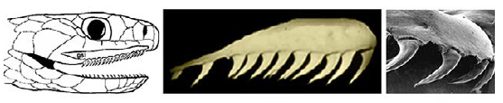
    <figcaption>
        
<b>Figura 1:</b> Dentição áglifa. <b>Fonte:</b> Brasil, 2024. <b>Autor da imagem:</b> Anibal R. Melgarejo, conforme publicação original.

    </figcaption>
</figure>

- **Opistóglifas:** possuem presas na região posterior da boca, as quais apresentam um sulco, como as muçuranas, cobras-verdes e cobras-cipó.

<figure class="base">
    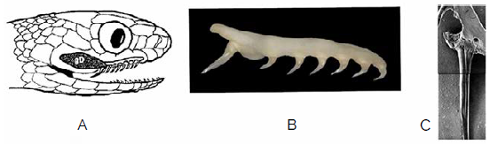
    <figcaption>
        
<b>Figura 2:</b> Dentição opistóglifa. <b>Fonte:</b> Brasil, 2024. <b>Autor da imagem:</b> Anibal R. Melgarejo, conforme publicação original.

    </figcaption>
</figure>

- **Proteróglifas:** possuem presas na região frontal da boca, as quais apresentam um sulco, como Corais-verdadeiras, najas e mambas.

<figure class="base">
    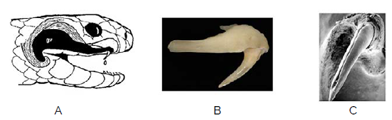
    <figcaption>
        
<b>Figura 3:</b> Dentição proteróglifa. <b>Fonte:</b> Brasil, 2024. <b>Autor da imagem:</b> Anibal R. Melgarejo, conforme publicação original.

    </figcaption>
</figure>

- **Solenóglifas:** possuem presas móveis na região frontal da boca, as quais apresentam um canalículo por onde o veneno é inoculado, como as jararacas, urutus e cascavéis.

<figure class="base">
    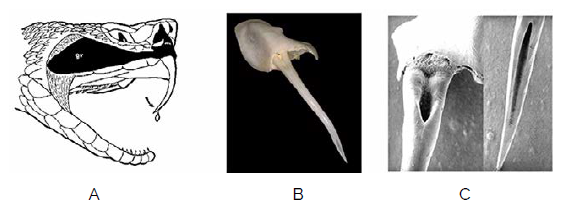
    <figcaption>
        
<b>Figura 4:</b> Dentição solenóglifa. <b>Fonte:</b> Brasil, 2024. <b>Autor da imagem:</b> Anibal R. Melgarejo, conforme publicação original.

    </figcaption>
</figure>

Espécies peçonhentas produzem toxinas para fins defensivos ou para subjugar suas presas. Apesar de os humanos não serem considerados presas naturais dessas espécies, acidentes com serpentes ocorrem regularmente em nosso país, e alguns casos podem levar à óbito (ALBUQUERQUE, 2022)[^2].

Envenenamento por serpentes é um problema de saúde pública global que carece de atenção das autoridades de saúde tanto nacionais quanto globais (GUTIERREZ *et al.*, 2010)[^3]. A maioria dos acidentes ofídicos é classificado como leve, porém o risco de agravamento pode se elever consideravelmente, devido à demora no atendimento médico e na administração do soro (BRASIL, 2024)[^16]. De acordo com a Organização Mundial da Saúde (OMS, 2020), a cada 5 minutos, 50 pessoas são picadas por serpentes, 25 delas, injetadas com veneno, das quais 4 ficarão permanentemente desabilitadas e 1 morrerá[^4].

# Serpentes de Importância Médica no Brasil

## Bothrops

*Bothrops* é um gênero da família Viperidae, conhecidas popularmente como Jararacas e Urutus. Elas são as responsáveis por mais de 80% dos acidentes ofídicos no Brasil (RIBEIRO & JORGE, 1997)[^5]. 

<figure class="base">
    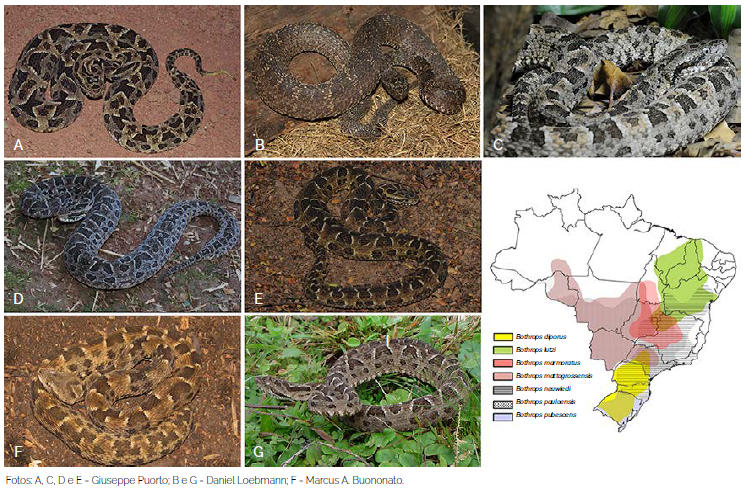Bothrops</i> e sua distribuição no Brasil">
    <figcaption>
        
<b>Figura 5:</b> Exemplares de espécies de <i>Bothrops</i> e sua distribuição no Brasil. <b>Fonte:</b> Brasil, 2024. <b>Autores da imagem:</b> Conforme publicação original.

    </figcaption>
</figure>

São serpentes com hábitos predominantemente noturnos ou crepusculares. Podem apresentar comportamento agressivo ao se sentirem ameaçadas (BRASIL, 2001)[^18]. As espécies de médio e grande porte são bem adaptadas a áreas antrópicas, atraídas por roedores que se proliferam em áreas de plantação, fato que justifica a alta incidência de acidentes causados por elas (BRASIL, 2024)[^16]. 

<figure class="base">
    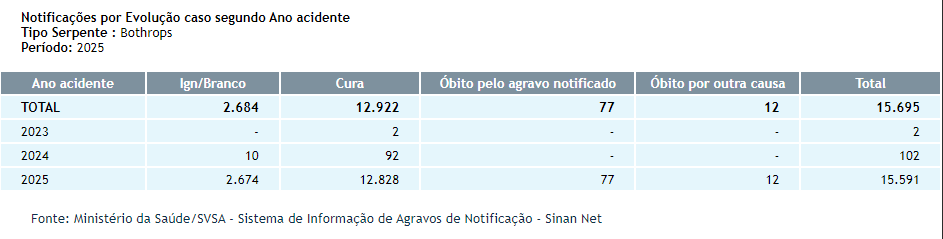Bothrops</i>">
    <figcaption>
        
<b>Figura 6:</b> Notificações de acidentes causados por <i>Bothrops</i>. <b>Fonte:</b> SINAN, 2019.<a href="#fn:6">6</a>

    </figcaption>
</figure>

O veneno botrópico é uma complexa mistura de proteínas, peptídeos, aminoácidos, nucleotídeos, lipídeos e carboidratos e possui três atividades principais: proteolítica ou necrosante, coagulante e hemolítica ou hemorrágica (KISAKI *et al.*, 2021)[^7]. 

<figure class="base">
    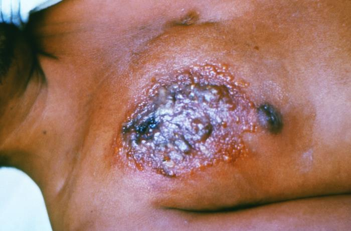
    <figcaption>
        
<b>Figura 7:</b> Lesão causada por acidente botrópico. <b>Fonte:</b> CDC.<a href="#fn:17">17</a>

    </figcaption>
</figure>

<figure class="base">
    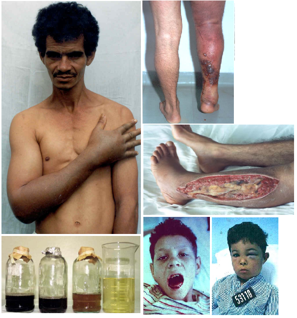
    <figcaption>
        
<b>Figura 8:</b> Lesões caudados por acidente botrópico. <b>Fonte:</b> São Paulo, 2013.<a href="#fn:19">19</a>

    </figcaption>
</figure>

<figure class="base">
    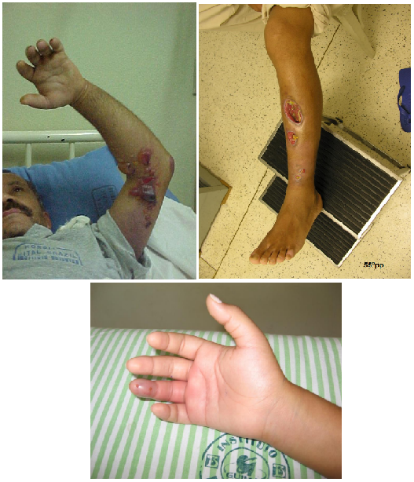
    <figcaption>
        
<b>Figura 9:</b> Lesões causadas por acidente botrópico. <b>Fonte:</b> Malaque, 2014.<a href="#fn:20">20</a>

    </figcaption>
</figure>

## Crotalus

*Crotalus* também é um gênero da família Viperidae, conhecidas popularmente como Cascavéis. Elas são responsáveis por cerca de 8% a 15% dos acidentes ofídicos e o envenenamento causado por elas é considerado de maior severidade que os envenenamentos botrópicos (SGARBI *et al.*, 1995)[^8].

<figure class="base">
    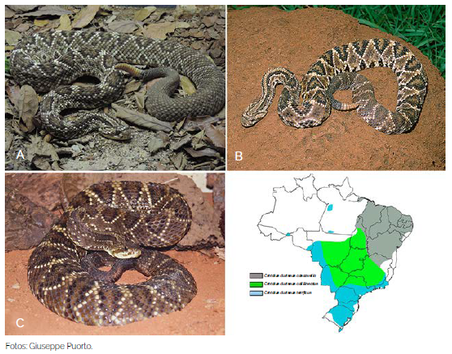Crotalus durissus</i>">
    <figcaption>
        
<b>Figura 10:</b> Exemplares de subespécies de <i>Crotalus durissus</i>. <b>Fonte:</b> Brasil, 2024.

    </figcaption>
</figure>

São serpentes pouco agressivas e, quando se sentem ameaçadas, denunciam sua presença recuando, agrupando o corpo e produzindo ruído com o guizo (chocalho). Assim como as jararacas, é uma espécie facilmente encontrada em áreas antrópicas (BRASIL, 2001; 2024)[^18][^16]. Em Marília, devido à economia e geografia da cidade, a prevalência de acidentes com *Crotalus* é maior que a média do país (SGARBI *et al.*, 1995)[^8].

<figure class="base">
    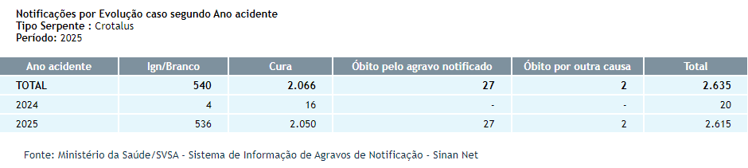Crotalus</i>">
    <figcaption>
        
<b>Figura 11:</b> Notificações de acidentes causados por <i>Crotalus</i>. <b>Fonte:</b> SINAN, 2019.<a href="#fn:6">6</a>

    </figcaption>
</figure>

O veneno crotálico é neurotóxico, miotóxico e coagulante, causando paralisia motora e respiratória, degradação da musculatura e incoagulabilidade (SANTOS *et al.*, 2019)[^9].

<figure class="base">
    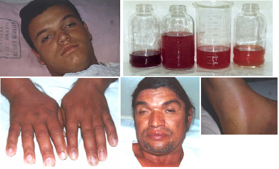
    <figcaption>
        
<b>Figura 12:</b> Lesões causadas por acidente crotálico. <b>Fonte:</b> São Paulo, 2013.<a href="#fn:19">19</a>

    </figcaption>
</figure>

## Micrurus

*Micrurus* é o principal gênero da família Elapidae nas Américas, conhecidas popularmente como Corais-verdadeiras. Acidentes com elas são raros, cerca de 1%, sendo a quarta causa de acidentes ofídicos no Brasil (BUCARETCHI *et al.*, 2006)[^10]. 

<figure class="base">
    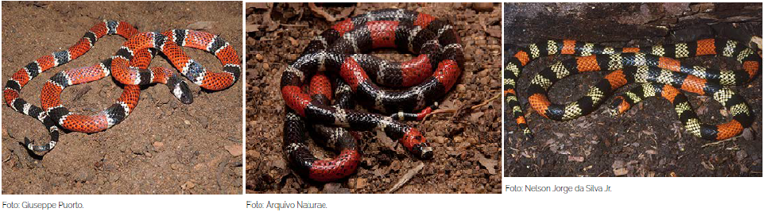Micrurus</i>">
    <figcaption>
        
<b>Figura 13:</b> Exemplares de espécies do gênero <i>Micrurus</i>. <b>Fonte:</b> Brasil, 2024. <b>Autores da imagem:</b> Conforme publicação original.

    </figcaption>
</figure>

Em geral, são serpentes de comportamento não agressivo, de hábitos fossoriais, com presas pequenas, pequena abertura de boca e com pequena quantidade de veneno que elas carregam e injetam (BISNETO, 2020)[^21], o que justifica a baixa incidência de acidentes provocados por elas.

<figure class="base">
    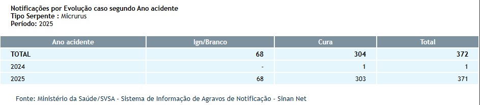Micrurus</i>">
    <figcaption>
        
<b>Figura 14:</b> Notificações de acidentes causados por <i>Micrurus</i>. <b>Fonte:</b> SINAN, 2019.<a href="#fn:6">6</a>

    </figcaption>
</figure>

São animais de pequeno e médio porte, com cerca de 1m de comprimento e com ampla distribuição no território nacional. Apresentam anéis vermelhos (em alguns casos, alaranjados), pretos e brancos (em alguns casos, amarelados) em várias combinações (BRASIL, 2001; 2024).

<figure class="base">
    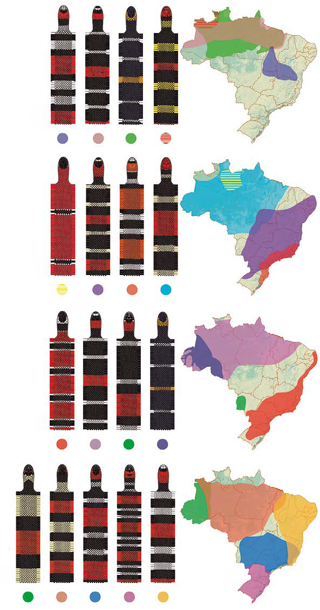
    <figcaption>
        
<b>Figura 15:</b> Padrões das cobras-corais de importância médica no Brasil e sua distribuição geográfica. <b>Fonte:</b> Brasil, 2024. <b>Autor da imagem:</b> Marcus A. Buononato, conforme publicação original.

    </figcaption>
</figure>

Além dessa semelhança entre elas, há ainda um ponto a se considerar na correta identificação desses animais: a existência das Falsas-corais. As corais falsas são serpentes das famílias Colubridae e Dipsadidae que mimetizam os padrões anelados das corais-verdadeiras e são tão amplamente dispersas pelo país, quanto suas "modelos" (BRASIL, 2024).

<figure class="base">
    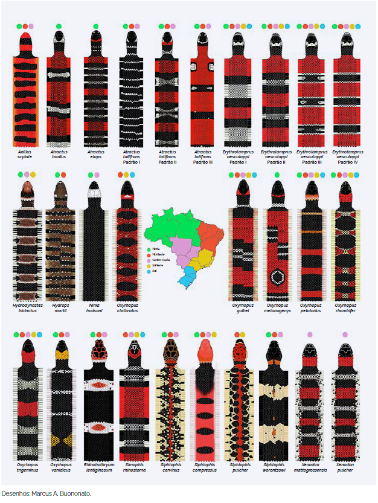
    <figcaption>
        
<b>Figura 16:</b> Padrões das cobras corais falsas mais comuns. <b>Fonte:</b> Brasil, 2024.

    </figcaption>
</figure>

O veneno das corais-verdadeiras é miotóxico, hemorrágico e edematogênico, e até hemolítico em alguns casos. (BUCARETCHI *et al.*, 2006)[^10]. 

<figure class="base">
    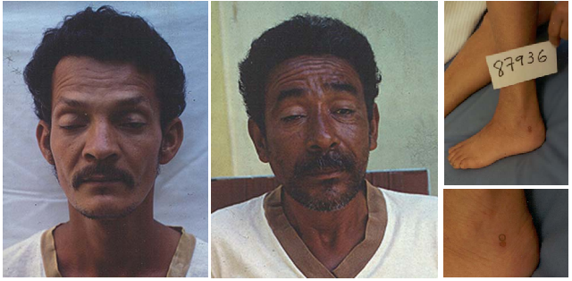
    <figcaption>
        
<b>Figura 17:</b> Lesões causadas por acidente elapídico. <b>Fonte:</b> São Paulo, 2013.<a href="#fn:19">19</a>

    </figcaption>
</figure>

## Menções honrosas

No Brasil, temos outras serpentes que também podem causar acidentes, mas, ou não temos na nossa região, como as *Lachesis*, ou pela dificuldade do acidente, devido à dentição opistóglifa, como as *Philodryas*.

### Lachesis

Com apenas uma espécie no Brasil, *Lachesis muta*, pertencem à família Viperidae, conhecidas popularmente como Surucucu ou Pico-de-Jaca. É a maior espécie de víbora do Brasil, podendo chegar a mais de 3m de comprimento (SACHETT *et al.*, 2022)[^11].

<figure class="base">
    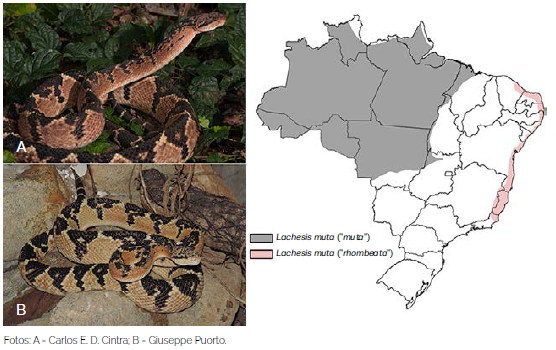Lachesis muta</i> e sua distribuição geográfica">
    <figcaption>
        
<b>Figura 18:</b> Exemplares de <i>Lachesis muta</i> e sua distribuição geográfica. <b>Fonte:</b> Brasil, 2024.

    </figcaption>
</figure>

Seu veneno tem composição muito parecida com o veneno botrópico, com características clínicas semelhantes, como inflamação, coagulação e hemorragia, podendo causar necrose e falência renal aguda (MAGALHÃES *et al.*, 2022)[^12].

<figure class="base">
    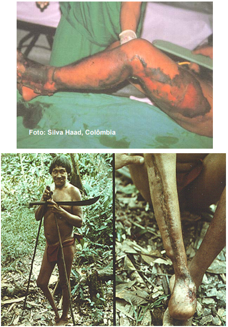
    <figcaption>
        
<b>Figura 19:</b> Lesões causadas por acidente laquético. <b>Fonte:</b> São Paulo, 2013.<a href="#fn:19">19</a>

    </figcaption>
</figure>

### Philodryas

*Philodryas* é um gênero da família Dipsadidae, conhecidas popularmente como Cobras-Verdes ou Cobras-Cipó. Elas não são consideradas peçonhentas, mas há casos de acidentes reportados na literatura acadêmica. 

<figure class="base">
    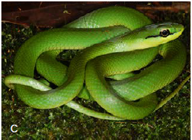Philodryas olfersii</i>">
    <figcaption>
        
<b>Figura 20:</b> Exemplar de <i>Philodryas olfersii</i>. <b>Fonte:</b> Brasil, 2024. <b>Autor da imagem:</b> Carlos E. D. Cintra, conforme publicação original.

    </figcaption>
</figure>

Seu veneno é mais potente que o das Bothrops, mas a anatomia opistóglifa das suas presas, que dificulta a inoculação do veneno, aliada a um comportamento não agressivo, explica a baixíssima incidência de casos (ARAÚJO & SANTOS, 1997)[^13].

<figure class="base">
    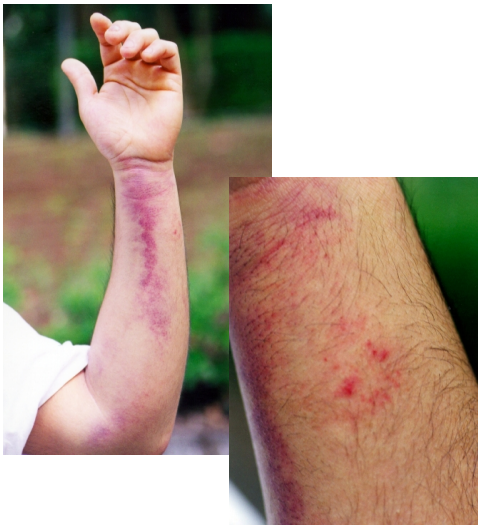Philodryas</i>">
    <figcaption>
        
<b>Figura 21:</b> Lesões causadas por acidente com <i>Philodryas</i>. <b>Fonte:</b> São Paulo, 2013.<a href="#fn:19">19</a>

    </figcaption>
</figure>

# Prevenção e Primeiros-Socorros em caso de acidente

## Introdução

Conhecer o agente, a causa e as circunstâncias de acidentes que já aconteceram é imprescindível para que saibamos as melhores formas de prevenir que ocorram novamente. Tratando-se de acidentes ofídicos, a maioria ocorre nos meses mais quentes e chuvosos (outubro a abril), atingindo principalmente pessoas do sexo masculino (cerca de 75% a 80% dos casos). As regiões mais atingidas foram os membros inferiores (pés, tornozelos e pernas), seguido dos membros superiores (mãos e antebraços)(CAIAFFA *et al.*, 1997[^22]; RIBEIRO & JORGE, 1997[^5]).

Até hoje, algumas crenças que supostamente tratam ou curam acidentes com animais peçonhentos, mas que são equivocados e podem contribuir com o agravamento do quadro, podendo, inclusive, gerar complicações secundárias por infecção, tais como a aplicação de torniquetes e aplicação de substâncias como borra de café, vinagre, urina, querosene etc. no local da picada (BRASIL, 2001; 2024).

## Prevenção de acidentes

Com base nessas informações, as principais ações para prevenir acidentes são:
- **Atenção:** Olhar com atenção onde pisa e/ou coloca a mão, principalmente em locais quentes, escuros e úmidos;
- **Uso de EPI:** Usar botas de cano alto ou perneiras de couro e sapatos fechados e luvas de aparas de couro;
- **Controle de pragas:** Controlar a população de roedores e pequenos animais que podem servir de alimento para as serpentes;
- **Limpeza:** Evitar acúmulo de lixo ou entulho, bem como não deixar mato alto ao redor das residências (BRASIL, 2001; 2024).

## Primeiros-socorros

Em casos de acidentes, o que se **DEVE** fazer:

- Procurar atendimento médico imediatamente;
- Fotografar ou informar ao profissional de saúde o máximo possível de características do animal;
- Se possível, lavar o local da picada com água e sabão;
- Manter a vítima em repouso com o membro acometido elevado até a chegada ao pronto-socorro;
- Manter a vítima hidratada;
- Retire todo e qualquer acessório que possa levar à piora do quadro clínico, como aneis, pulseiras, fitas e calçados apertados.

O que **NÃO** fazer:

- Não aplicar torniquete ou garrote no membro acometido;
- Não cortar, queimar, espremer ou aplicar qualquer tipo de substância, tais como borra de café, álcool, terra, folhas, fezes, urina, entre outros no local da picada;
- Não fazer curativo no local da picada, pois pode favorecer a ocorrência de infecção;
- Não dar bebidas alcoólicas ou outros líquidos como gasolina ou querosene à vitima, pois podem causar problemas gastrointestinais, além de não terem efeito contra a peçonha;
- Não tentar chupar o veneno, pois pode favorecer a ocorrência de infecção.

# Conclusão

Reconhecer e classificar corretamente as serpentes é essencial, principalmente as de importância médica, pois são base para estudos toxinológicos e para formulação do soro antiofídico (soro antivenômico), que é o único tratamento para envenenamento por serpentes (LOBO *et al.*, 2014; OLIVEIRA *et al.*, 2018[^15]). Por isso é muito importante que, em caso de acidente, se possível, apresentar o animal que o causou, seja por fotografia ou o próprio animal. Neste caso, a conservação do animal pode ser feita pela imersão em álcool comum, em recipiente apropriado, com dados do local do acidente para ser encaminhado para identificação correta (BRASIL, 2024)[^16].

---
[^1]: COSTA H.C., GUEDES, T.B., BÉRNILS, R.S. Lista de répteis do Brasil: padrões e tendências. **Herpetologia Brasileira**, São Paulo, v. 10, n. 3, p. 111-279, 2021. ISSN: 2316-4670. DOI: https://doi.org/10.5281/zenodo.5838950. Disponível em: https://www.researchgate.net/publication/358277210_Lista_de_repteis_do_Brasil_padroes_e_tendencias. Acesso em 30 dez. 2025.

[^2]: ALBUQUERQUE, N.R. **Manual de identificação das serpentes peçonhentas de Mato Grosso do Sul**. Campo Grande, MS, Brasil. Editora UFMS, 2022. ISBN 978-65-89995-26-5. Disponível em: https://repositorio.ufms.br/handle/123456789/5116. Acesso em: 07 dez. 2025.

[^3]: GUTIÉRREZ, J.M.; WILLIAMS, D.; FAN, H. W.; WARRELL, D.A. Snakebite envenoming from a global perspective: Towards an integrated approach. **Toxicon**, Volume 56, Issue 7, Pages 1223-1235, 2010. ISSN 0041-0101. DOI: https://doi.org/10.1016/j.toxicon.2009.11.020. Disponível em: https://www.sciencedirect.com/science/article/pii/S0041010109005510. Acesso em: 07 dez. 2025.

[^4]: WORLD HEALTH ORGANIZATION GIS CENTRE FOR HEALTH. Open Data Solutions for Preventable Snakebite Deaths. 2020. Disponível em: https://storymaps.arcgis.com/stories/20d04a1d369444599e9971167befa7a8. Acesso em: 07 dez. 2025.

[^5]: RIBEIRO, L.A.; JORGE, M.T. Bites by snakes in the genus Bothrops: A series of 3139 cases. **Revista da Sociedade Brasileira de Medicina Tropical** 1997, 30, 475–480. DOI: https://doi.org/10.1590/S0037-86821997000600006. Disponível em: https://www.scielo.br/j/rsbmt/a/FSFzKrtGRtDrTGhGqg6TJth/. Acesso em: 07 dez. 2025.

[^6]: BRASIL. Ministério da Saúde. Sistema de Informação de Agravos de Notificação - Sinan Net. Brasília: Ministério da Saúde, 16 abr. 2019. Disponível em: http://tabnet.datasus.gov.br/cgi/deftohtm.exe?sinannet/cnv/animaisbr.def. Acesso em: 07 dez. 2025.

[^7]: KISAKI, C.Y.; ARCOS, S.S.S.; MONTONI, F.; da SILVA SANTOS, W.; CALACINA, H.M.; LIMA, I.F.; CAJADO-CARVALHO, D.; FERRO, E.S.; NISHIYAMA-JR, M.Y.; IWAI, L.K. Bothrops Jararaca Snake Venom Modulates Key Cancer-Related Proteins in Breast Tumor Cell Lines. **Toxins** 13, 519, 2021. DOI: https://doi.org/10.3390/toxins13080519. Disponível em: https://www.mdpi.com/2072-6651/13/8/519#B2-toxins-13-00519. Acesso em: 07 dez. 2025.

[^8]: SGARBI, L.P.S.; ILIAS, M.; MACHADO, T.;ALVAREZ, L.; BARRAVIERA, B. Human envenomations due to snakebites in Marilia, State of São Paulo, Brazil. A Retrospective Epidemiological Study. **Journal of Venomous Animals**, Volume 1, Issue 2, 1995. DOI: https://doi.org/10.1590/S0104-79301995000200004. Disponível em: https://www.scielo.br/j/jvat/a/qJtHK8qK9p9cX7J3FcDqz9q/. Acesso em: 07 dez. 2025.

[^9]: SANTOS, H.L.R.; SOUZA, J.D. de B.; ALCÂNTARA, J.A.; SACHETT, J. de A.G.; VILLAS BOAS, T.S.; SARAIVA, I.; BERNARDE, P.S.; MAGALHÃES, S.F.V.; de MELO, G.C.; PEIXOTO, H.M.; OLIVEIRA, M.R.; SAMPAIO, R.; MOTEIRO, W.M. Rattlesnakes bites in the Brazilian Amazon: Clinical epidemiology, spatial distribution and ecological determinants. **Acta Tropica**, Volume 191, Pages 69-76, 2019. ISSN 0001-706X,. DOI: https://doi.org/10.1016/j.actatropica.2018.12.030. Disponível em: https://www.sciencedirect.com/science/article/pii/S0001706X18308817. Acesso em: 13 dez. 2025.

[^10]: BUCARETCHI, F.; HYSLOP, S.; VIEIRA, R.; TOLEDO, A.; MADUREIRA, P.; DE CAPITANI, E. Acidentes por serpentes corais (Micrurus spp.) em Campinas, Estado de São Paulo, sudeste do Brasil. **Revista do Instituto de Medicina Tropical de São Paulo**, Volume 48, Páginas 141-145, 2006. DOI: https://doi.org/10.1590/S0036-46652006000300005. Disponível em: https://www.scielo.br/j/rimtsp/a/7drP9897P5jLPNM8yhMDqFm. Acesso em: 29 dez. 2025.

[^11]: SACHETT J.A.G.; MARINHO A.P.S.; SANTOS M.M.O.; FAN H.W.; BERNARDE P.S.; MONTEIRO W.M. When to think about a Lachesis muta envenomation in the Western Brazilian Amazon: Lessons from a case report. **Revista da Sociedade Brasileira de Medicina Tropical**, Volume 55, 2022. DOI: https://doi.org/10.1590/0037-8682-0027-2022. Disponível em: https://pmc.ncbi.nlm.nih.gov/articles/PMC9549943/. Acesso em: 29 dez. 2025.

[^12]: MAGALHÃES, S.F.V.; PEIXOTO, H.M.; FREITAS, L.R.S.; MONTEIRO, W.M.; OLIVEIRA, M.R.F. Snakebites caused by the genera _Bothrops_ and _Lachesis_ in the Brazilian Amazon: a study of factors associated with severe cases and death. **Revista da Sociedade Brasileira de Medicina Tropical**, Volume 55, 2022. DOI: https://doi.org/10.1590/0037-8682-0558-2021. Disponível em: https://www.scielo.br/j/rsbmt/a/szbTJTbCDhBwdj54zPHQrJm. Acesso em: 29 dez. 2025.

[^13]: ARAÚJO, M.E.; SANTOS, A.C.M.C.A. Cases of human envenoming caused by Philodryas olfersii and Philodryas patagoniensis (serpentes: Colubridae). **Revista da Sociedade Brasileira de Medicina Tropical**, Volume 30, 1997. DOI: https://doi.org/10.1590/S0037-86821997000600013. Disponível em: https://www.scielo.br/j/rsbmt/a/GJ63Hcsp9RNk4jfsQrGWqXC. Acesso em: 29 dez. 2025.

[^14]: LOBO, L. M.; VIANA, D. C.; OLIO, R. L.; DOS SANTOS, A. C.; FURNALETTO MANÇANARES, C. A. ANÁLISE COMPARATIVA DOS DIFERENTES TIPOS DE DENTIÇÃO EM SERPENTES. **Acta Tecnológica**, _[S. l.]_, v. 9, n. 2, p. 1–8, 2014. DOI: https://doi.org/10.35818/acta.v9i2.196. Disponível em: https://periodicos.ifma.edu.br/index.php/actatecnologica/article/view/196. Acesso em: 29 dez. 2025.

[^15]: OLIVEIRA, I.S.; PUCCA, M.B.; SAMPAIO, S.V.; ARANTES, E.C. Antivenomic approach of different _Crotalus durissus collilineatus_ venoms. **Journal of Venomous Animals and Toxins Including Tropical Diseases**, Volume 24, 34, 2018. DOI: https://doi.org/10.1186/s40409-018-0169-4. Disponível em: https://link.springer.com/article/10.1186/s40409-018-0169-4. Acesso em: 13 dez. 2025.

[^16]: BRASIL. Ministério da Saúde. Secretaria de Vigilância em Saúde e Ambiente. Departamento de Doenças Transmissíveis. **Guia de Animais Peçonhentos do Brasil**. Brasília, 2024. 164 p.  

[^17]: Centers for Disease Control and Prevention (CDC).(n.d.). **Public Health Image Library (PHIL)**. Disponível em: https://phil.cdc.gov/default.aspx. Acesso em: 29 dez. 2025.

[^18]: BRASIL. Ministério da Saúde. Fundação Nacional de Saúde (FUNASA). Manual de Diagnóstico e Tratamento de Acidentes por Animais Peçonhentos. Brasília: Fundação Nacional de Saúde, 2001. Disponível em: https://www.gov.br/saude/pt-br/centrais-de-conteudo/publicacoes/guias-e-manuais/2024/manual-de-diagnostico-e-tratamento-de-acidentes-por-animais-peconhentos.pdf. Acesso em: 29 dez. 2025.

[^19]: SÃO PAULO. Centro de Vigilância Epidemiológica. Acidentes por animais peçonhentos. Instituto Butantan, 2013. Disponível em: http://www.saude.sp.gov.br/resources/cve-centro-de-vigilancia-epidemiologica/areas-de-vigilancia/doencas-de-transmissao-por-vetores-e-zoonoses/aula03_peconhentos.pdf. Acesso em: 30 dez. 2025.

[^20]: MALAQUE, C.M.S. Acidentes por animais peçonhentos. Hospital Vital Brazil, Instituto Butantan, 2014. Disponível em: http://www.saude.sp.gov.br/resources/cve-centro-de-vigilancia-epidemiologica/areas-de-vigilancia/doencas-de-transmissao-por-vetores-e-zoonoses/doc/peconhentos/peco16_acidentes_ofidicos_sjrp.pdf. Acesso em: 30 dez. 2025.

[^21]: BISNETO, P.F.; ARAÚJO, B.S.; PEREIRA, H.S.; SILVA, I.M.; SACHETT, J.A.G.; BERNARDE, P.S.; MONTEIRO, W.M.; KAEFER, I.L. Envenomations by coral snakes in an Amazonian metropolis: Ecological, epidemiological and clinical aspects. **Toxicon**, Volume 185, Pages 193-202, 2020. ISSN 0041-0101. DOI: https://doi.org/10.1016/j.toxicon.2020.07.009. Disponível em: https://www.sciencedirect.com/science/article/pii/S0041010120303135. Acesso em: 30 dez. 2025.

[^22]: CAIAFFA, W.T.;ANTUNES, C.M.F.; OLIVEIRA, H.R.; DINIZ, C.R. Epidemiological and clinical aspects of snakebite in Belo Horizonte, Southeast Brazil. **Revista do Instituto de Medicina Tropical de São Paulo**, Volume 39, 1997. DOI: https://doi.org/10.1590/S0036-46651997000200009. Disponível em: https://www.scielo.br/j/rimtsp/a/Phf4dCkw3mcKYBvsmN3VTcF/. Acesso em: 30 dez. 2025.
